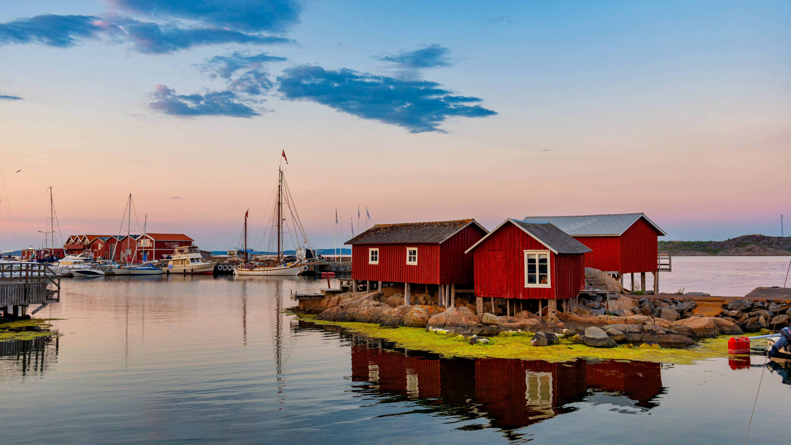

```json
{
  "images": [
    {
      "startdate": "20220817",
      "fullstartdate": "202208171600",
      "enddate": "20220818",
      "url": "/th?id=OHR.SourHerring_ZH-CN4136738467_UHD.jpg&rf=LaDigue_UHD.jpg&pid=hp&w=3840&h=2160&rs=1&c=4",
      "urlbase": "/th?id=OHR.SourHerring_ZH-CN4136738467",
      "copyright": "哥德堡群岛的岸边，瑞典 (© Martin Wahlborg/Getty Images)",
      "copyrightlink": "/search?q=%e5%93%a5%e5%be%b7%e5%a0%a1%e7%be%a4%e5%b2%9b&form=hpcapt&mkt=zh-cn",
      "title": "世界最臭食物之乡？",
      "quiz": "/search?q=Bing+homepage+quiz&filters=WQOskey:%22HPQuiz_20220817_SourHerring%22&FORM=HPQUIZ",
      "wp": true,
      "hsh": "e99f19cb7a8f7cba196ef86e1a635e02",
      "drk": 1,
      "top": 1,
      "bot": 1,
      "hs": []
    }
  ],
  "tooltips": {
    "loading": "正在加载...",
    "previous": "上一个图像",
    "next": "下一个图像",
    "walle": "此图片不能下载用作壁纸。",
    "walls": "下载今日美图。仅限用作桌面壁纸。"
  }
}
```
