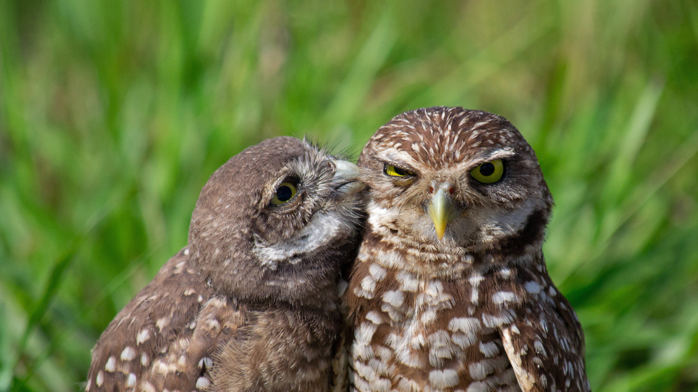

```json
{
  "images": [
    {
      "startdate": "20220821",
      "fullstartdate": "202208211600",
      "enddate": "20220822",
      "url": "/th?id=OHR.TenderMoment_ZH-CN5447705408_UHD.jpg&rf=LaDigue_UHD.jpg&pid=hp&w=3840&h=2160&rs=1&c=4",
      "urlbase": "/th?id=OHR.TenderMoment_ZH-CN5447705408",
      "copyright": "南佛罗里达的一只穴小鸮雏鸟和一只成年穴小鸮，美国 (© Carlos Carreno/Getty Images)",
      "copyrightlink": "/search?q=%e7%a9%b4%e5%b0%8f%e9%b8%ae&form=hpcapt&mkt=zh-cn",
      "title": "猫头鹰界的叛逆小鸟",
      "quiz": "/search?q=Bing+homepage+quiz&filters=WQOskey:%22HPQuiz_20220821_TenderMoment%22&FORM=HPQUIZ",
      "wp": true,
      "hsh": "845e71a524921de6b516254bf4444b06",
      "drk": 1,
      "top": 1,
      "bot": 1,
      "hs": []
    }
  ],
  "tooltips": {
    "loading": "正在加载...",
    "previous": "上一个图像",
    "next": "下一个图像",
    "walle": "此图片不能下载用作壁纸。",
    "walls": "下载今日美图。仅限用作桌面壁纸。"
  }
}
```
