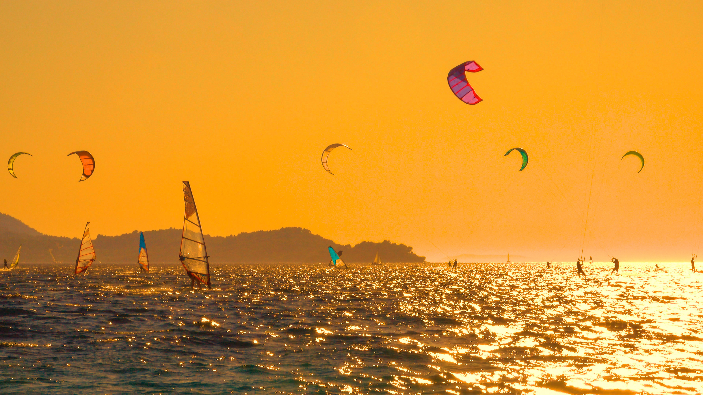

```json
{
  "images": [
    {
      "startdate": "20220825",
      "fullstartdate": "202208251600",
      "enddate": "20220826",
      "url": "/th?id=OHR.PeljesacWind_ZH-CN9299214248_UHD.jpg&rf=LaDigue_UHD.jpg&pid=hp&w=3840&h=2160&rs=1&c=4",
      "urlbase": "/th?id=OHR.PeljesacWind_ZH-CN9299214248",
      "copyright": "克罗地亚佩列沙茨半岛附近的风筝冲浪者和风帆冲浪者 (© helivideo/Getty Images)",
      "copyrightlink": "/search?q=%e4%bd%a9%e5%88%97%e6%b2%99%e8%8c%a8%e5%8d%8a%e5%b2%9b&form=hpcapt&mkt=zh-cn",
      "title": "既有风，又有水",
      "quiz": "/search?q=Bing+homepage+quiz&filters=WQOskey:%22HPQuiz_20220825_PeljesacWind%22&FORM=HPQUIZ",
      "wp": true,
      "hsh": "ef493c1d9f7e33f8f029653207d2802f",
      "drk": 1,
      "top": 1,
      "bot": 1,
      "hs": []
    }
  ],
  "tooltips": {
    "loading": "正在加载...",
    "previous": "上一个图像",
    "next": "下一个图像",
    "walle": "此图片不能下载用作壁纸。",
    "walls": "下载今日美图。仅限用作桌面壁纸。"
  }
}
```
