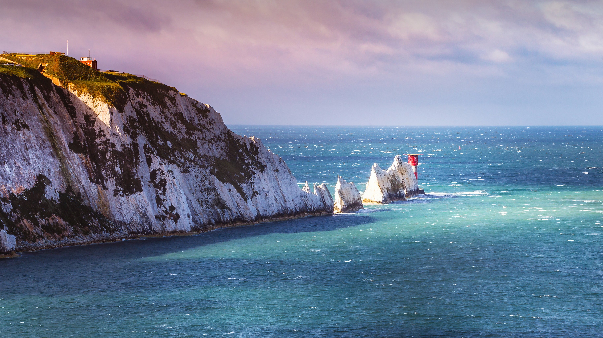

```json
{
  "images": [
    {
      "startdate": "20220906",
      "fullstartdate": "202209061600",
      "enddate": "20220907",
      "url": "/th?id=OHR.TheNeedles_ZH-CN6578835963_UHD.jpg&rf=LaDigue_UHD.jpg&pid=hp&w=3840&h=2160&rs=1&c=4",
      "urlbase": "/th?id=OHR.TheNeedles_ZH-CN6578835963",
      "copyright": "英格兰怀特岛上的尼德尔斯白垩岩石和19世纪的灯塔。 (© CBCK Christine/iStock/Getty Images Plus)",
      "copyrightlink": "/search?q=%e5%b0%bc%e5%be%b7%e5%b0%94%e6%96%af%e7%99%bd%e5%9e%a9%e5%b2%a9%e7%9f%b3&form=hpcapt&mkt=zh-cn",
      "title": "看起来很锋利的岩石",
      "quiz": "/search?q=Bing+homepage+quiz&filters=WQOskey:%22HPQuiz_20220906_TheNeedles%22&FORM=HPQUIZ",
      "wp": true,
      "hsh": "58abdc06aaa7e831f1f8e4aa0cb7e4c8",
      "drk": 1,
      "top": 1,
      "bot": 1,
      "hs": []
    }
  ],
  "tooltips": {
    "loading": "正在加载...",
    "previous": "上一个图像",
    "next": "下一个图像",
    "walle": "此图片不能下载用作壁纸。",
    "walls": "下载今日美图。仅限用作桌面壁纸。"
  }
}
```
