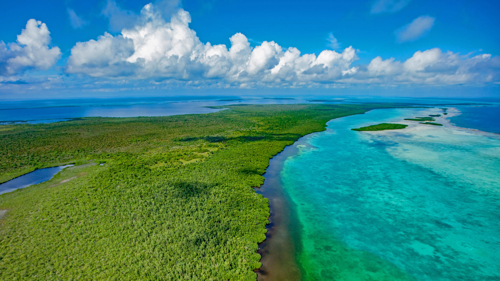

```json
{
  "images": [
    {
      "startdate": "20220908",
      "fullstartdate": "202209081600",
      "enddate": "20220909",
      "url": "/th?id=OHR.BHNMBelize_ZH-CN9422261941_UHD.jpg&rf=LaDigue_UHD.jpg&pid=hp&w=3840&h=2160&rs=1&c=4",
      "urlbase": "/th?id=OHR.BHNMBelize_ZH-CN9422261941",
      "copyright": "伯利兹堡礁保护区, 伯利兹 (© Tom Till/Alamy)",
      "copyrightlink": "/search?q=%e4%bc%af%e5%88%a9%e5%85%b9%e5%a0%a1%e7%a4%81%e4%bf%9d%e6%8a%a4%e5%8c%ba&FORM=hpcapt&mkt=zh-cn",
      "title": "另一个大堡礁",
      "quiz": "/search?q=Bing+homepage+quiz&filters=WQOskey:%22HPQuiz_20220908_BHNMBelize%22&FORM=HPQUIZ",
      "wp": true,
      "hsh": "59b2d07462f103108b18fc546454f127",
      "drk": 1,
      "top": 1,
      "bot": 1,
      "hs": []
    }
  ],
  "tooltips": {
    "loading": "正在加载...",
    "previous": "上一个图像",
    "next": "下一个图像",
    "walle": "此图片不能下载用作壁纸。",
    "walls": "下载今日美图。仅限用作桌面壁纸。"
  }
}
```
