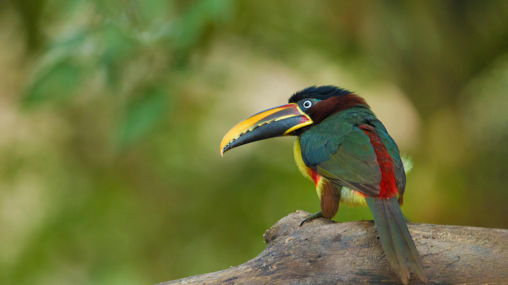

```json
{
  "images": [
    {
      "startdate": "20220911",
      "fullstartdate": "202209111600",
      "enddate": "20220912",
      "url": "/th?id=OHR.Aracari_ZH-CN0383753817_UHD.jpg&rf=LaDigue_UHD.jpg&pid=hp&w=3840&h=2160&rs=1&c=4",
      "urlbase": "/th?id=OHR.Aracari_ZH-CN0383753817",
      "copyright": "栗耳簇舌巨嘴鸟，巴西潘塔纳尔保护区里 (© Ana Gram/Shutterstock)",
      "copyrightlink": "/search?q=%e6%a0%97%e8%80%b3%e7%b0%87%e8%88%8c%e5%b7%a8%e5%98%b4%e9%b8%9f&form=hpcapt&mkt=zh-cn",
      "title": "一种巨嘴鸟",
      "quiz": "/search?q=Bing+homepage+quiz&filters=WQOskey:%22HPQuiz_20220911_Aracari%22&FORM=HPQUIZ",
      "wp": true,
      "hsh": "3cc1aa8b5a6dc8101be1dc78b7d643f5",
      "drk": 1,
      "top": 1,
      "bot": 1,
      "hs": []
    }
  ],
  "tooltips": {
    "loading": "正在加载...",
    "previous": "上一个图像",
    "next": "下一个图像",
    "walle": "此图片不能下载用作壁纸。",
    "walls": "下载今日美图。仅限用作桌面壁纸。"
  }
}
```
