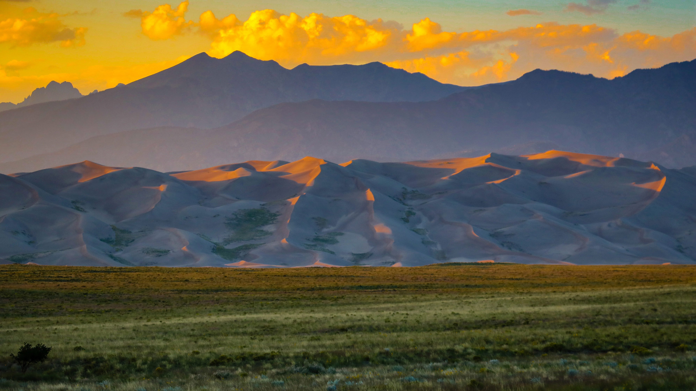

```json
{
  "images": [
    {
      "startdate": "20220912",
      "fullstartdate": "202209121600",
      "enddate": "20220913",
      "url": "/th?id=OHR.GSDNPest_ZH-CN0818304791_UHD.jpg&rf=LaDigue_UHD.jpg&pid=hp&w=3840&h=2160&rs=1&c=4",
      "urlbase": "/th?id=OHR.GSDNPest_ZH-CN0818304791",
      "copyright": "大沙丘国家公园和保护区，美国科罗拉多州 (© Y Paudel/Getty Images)",
      "copyrightlink": "/search?q=%e5%a4%a7%e6%b2%99%e4%b8%98%e5%9b%bd%e5%ae%b6%e5%85%ac%e5%9b%ad&form=hpcapt&mkt=zh-cn",
      "title": "如沙漏中的沙子一般",
      "quiz": "/search?q=Bing+homepage+quiz&filters=WQOskey:%22HPQuiz_20220912_GSDNPest%22&FORM=HPQUIZ",
      "wp": true,
      "hsh": "a98c59bd405cbe8c4c86b71d5a2526af",
      "drk": 1,
      "top": 1,
      "bot": 1,
      "hs": []
    }
  ],
  "tooltips": {
    "loading": "正在加载...",
    "previous": "上一个图像",
    "next": "下一个图像",
    "walle": "此图片不能下载用作壁纸。",
    "walls": "下载今日美图。仅限用作桌面壁纸。"
  }
}
```
