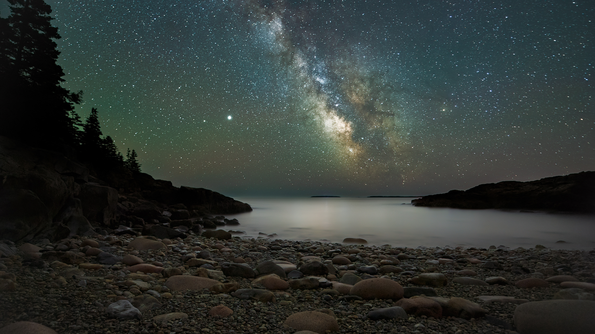

```json
{
  "images": [
    {
      "startdate": "20220923",
      "fullstartdate": "202209231600",
      "enddate": "20220924",
      "url": "/th?id=OHR.DarkSkyAcadia_ZH-CN1827511700_UHD.jpg&rf=LaDigue_UHD.jpg&pid=hp&w=3840&h=2160&rs=1&c=4",
      "urlbase": "/th?id=OHR.DarkSkyAcadia_ZH-CN1827511700",
      "copyright": "阿卡迪亚国家公园上空的银河系，美国缅因州 (© Harry Collins/Getty Images)",
      "copyrightlink": "/search?q=%e9%98%bf%e5%8d%a1%e8%bf%aa%e4%ba%9a%e5%9b%bd%e5%ae%b6%e5%85%ac%e5%9b%ad&form=hpcapt&mkt=zh-cn",
      "title": "繁星闪烁的夜晚",
      "quiz": "/search?q=Bing+homepage+quiz&filters=WQOskey:%22HPQuiz_20220923_DarkSkyAcadia%22&FORM=HPQUIZ",
      "wp": true,
      "hsh": "5b0fbd67bc112bea79a999049f19afe8",
      "drk": 1,
      "top": 1,
      "bot": 1,
      "hs": []
    }
  ],
  "tooltips": {
    "loading": "正在加载...",
    "previous": "上一个图像",
    "next": "下一个图像",
    "walle": "此图片不能下载用作壁纸。",
    "walls": "下载今日美图。仅限用作桌面壁纸。"
  }
}
```
