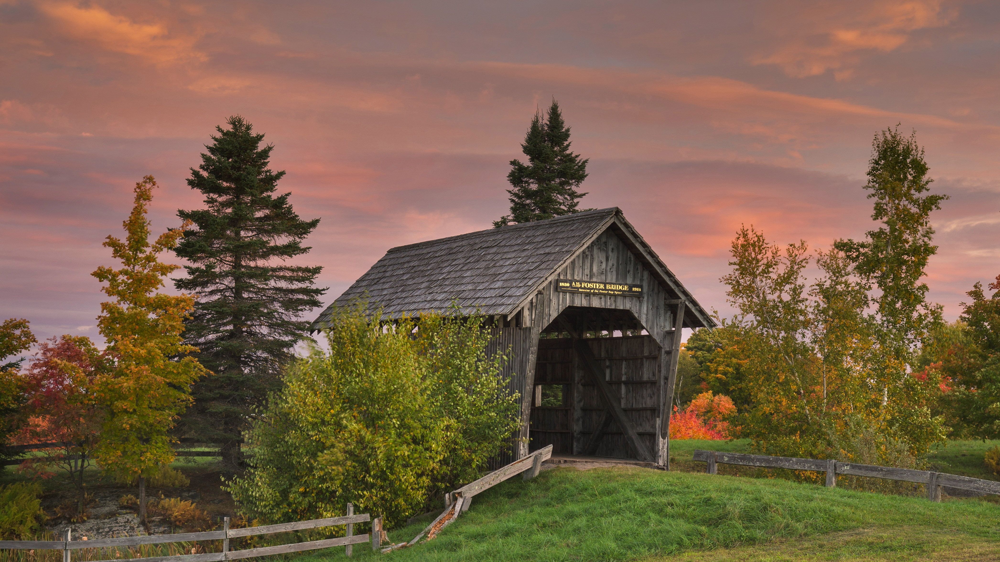

```json
{
  "images": [
    {
      "startdate": "20220927",
      "fullstartdate": "202209271600",
      "enddate": "20220928",
      "url": "/th?id=OHR.FosterCoveredBridge_ZH-CN2672988563_UHD.jpg&rf=LaDigue_UHD.jpg&pid=hp&w=3840&h=2160&rs=1&c=4",
      "urlbase": "/th?id=OHR.FosterCoveredBridge_ZH-CN2672988563",
      "copyright": "卡伯特镇的福斯特廊桥，美国佛蒙特州 (© Alan Majchrowicz/Getty Images)",
      "copyrightlink": "/search?q=%e7%a6%8f%e6%96%af%e7%89%b9%e5%bb%8a%e6%a1%a5&form=hpcapt&mkt=zh-cn",
      "title": "一场现代化的重建",
      "quiz": "/search?q=Bing+homepage+quiz&filters=WQOskey:%22HPQuiz_20220927_FosterCoveredBridge%22&FORM=HPQUIZ",
      "wp": true,
      "hsh": "6139e125280cac150f8f062b225e76a3",
      "drk": 1,
      "top": 1,
      "bot": 1,
      "hs": []
    }
  ],
  "tooltips": {
    "loading": "正在加载...",
    "previous": "上一个图像",
    "next": "下一个图像",
    "walle": "此图片不能下载用作壁纸。",
    "walls": "下载今日美图。仅限用作桌面壁纸。"
  }
}
```
