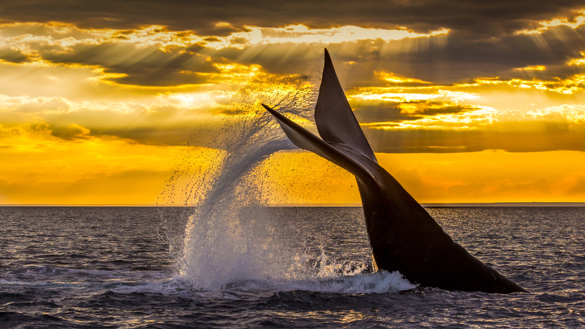

```json
{
  "images": [
    {
      "startdate": "20220929",
      "fullstartdate": "202209291600",
      "enddate": "20220930",
      "url": "/th?id=OHR.EubalaenaAustralis_ZH-CN3366455170_UHD.jpg&rf=LaDigue_UHD.jpg&pid=hp&w=3840&h=2160&rs=1&c=4",
      "urlbase": "/th?id=OHR.EubalaenaAustralis_ZH-CN3366455170",
      "copyright": "在新湾潜水的南露脊鲸，阿根廷瓦尔德斯半岛 (© Gabriel Rojo/Minden Pictures)",
      "copyrightlink": "/search?q=%e5%8d%97%e9%9c%b2%e8%84%8a%e9%b2%b8&form=hpcapt&mkt=zh-cn",
      "title": "南冰洋里的巨鲸",
      "quiz": "/search?q=Bing+homepage+quiz&filters=WQOskey:%22HPQuiz_20220929_EubalaenaAustralis%22&FORM=HPQUIZ",
      "wp": true,
      "hsh": "f1e96a4864de9edcc476e62cb6e64eb6",
      "drk": 1,
      "top": 1,
      "bot": 1,
      "hs": []
    }
  ],
  "tooltips": {
    "loading": "正在加载...",
    "previous": "上一个图像",
    "next": "下一个图像",
    "walle": "此图片不能下载用作壁纸。",
    "walls": "下载今日美图。仅限用作桌面壁纸。"
  }
}
```
