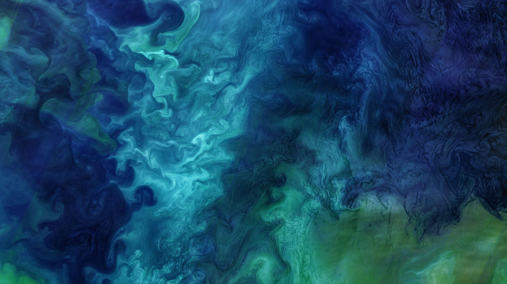

```json
{
  "images": [
    {
      "startdate": "20221008",
      "fullstartdate": "202210081600",
      "enddate": "20221009",
      "url": "/th?id=OHR.ChukchiSea_ZH-CN7218471261_UHD.jpg&rf=LaDigue_UHD.jpg&pid=hp&w=3840&h=2160&rs=1&c=4",
      "urlbase": "/th?id=OHR.ChukchiSea_ZH-CN7218471261",
      "copyright": "楚科奇海的浮游植物水华，美国阿拉斯加州海岸附近 (© Norman Kuring/Kathryn Hansen/U.S. Geological Survey/NASA)",
      "copyrightlink": "/search?q=%e6%b5%ae%e6%b8%b8%e6%a4%8d%e7%89%a9%e6%b0%b4%e5%8d%8e&form=hpcapt&mkt=zh-cn",
      "title": "什么生长得这样茂盛？",
      "quiz": "/search?q=Bing+homepage+quiz&filters=WQOskey:%22HPQuiz_20221008_ChukchiSea%22&FORM=HPQUIZ",
      "wp": true,
      "hsh": "82f8c29af90cf7cac7d6368037d504d0",
      "drk": 1,
      "top": 1,
      "bot": 1,
      "hs": []
    }
  ],
  "tooltips": {
    "loading": "正在加载...",
    "previous": "上一个图像",
    "next": "下一个图像",
    "walle": "此图片不能下载用作壁纸。",
    "walls": "下载今日美图。仅限用作桌面壁纸。"
  }
}
```
