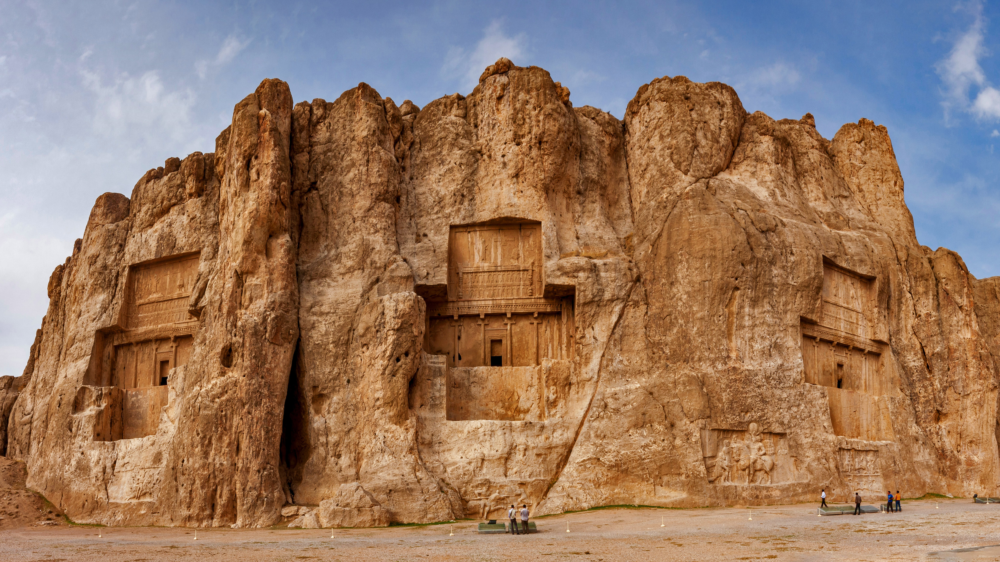

```json
{
  "images": [
    {
      "startdate": "20221014",
      "fullstartdate": "202210141600",
      "enddate": "20221015",
      "url": "/th?id=OHR.NaqsheRustam_ZH-CN9695151436_UHD.jpg&rf=LaDigue_UHD.jpg&pid=hp&w=3840&h=2160&rs=1&c=4",
      "urlbase": "/th?id=OHR.NaqsheRustam_ZH-CN9695151436",
      "copyright": "纳克什鲁斯塔姆遗址，伊朗波斯波利斯 (© mshirani/Shutterstock)",
      "copyrightlink": "/search?q=%e6%b3%a2%e6%96%af%e6%b3%a2%e5%88%a9%e6%96%af&form=hpcapt&mkt=zh-cn",
      "title": "国际考古日",
      "quiz": "/search?q=Bing+homepage+quiz&filters=WQOskey:%22HPQuiz_20221014_NaqsheRustam%22&FORM=HPQUIZ",
      "wp": true,
      "hsh": "7037a3a4d30ad9317ab8c52f64673e22",
      "drk": 1,
      "top": 1,
      "bot": 1,
      "hs": []
    }
  ],
  "tooltips": {
    "loading": "正在加载...",
    "previous": "上一个图像",
    "next": "下一个图像",
    "walle": "此图片不能下载用作壁纸。",
    "walls": "下载今日美图。仅限用作桌面壁纸。"
  }
}
```
