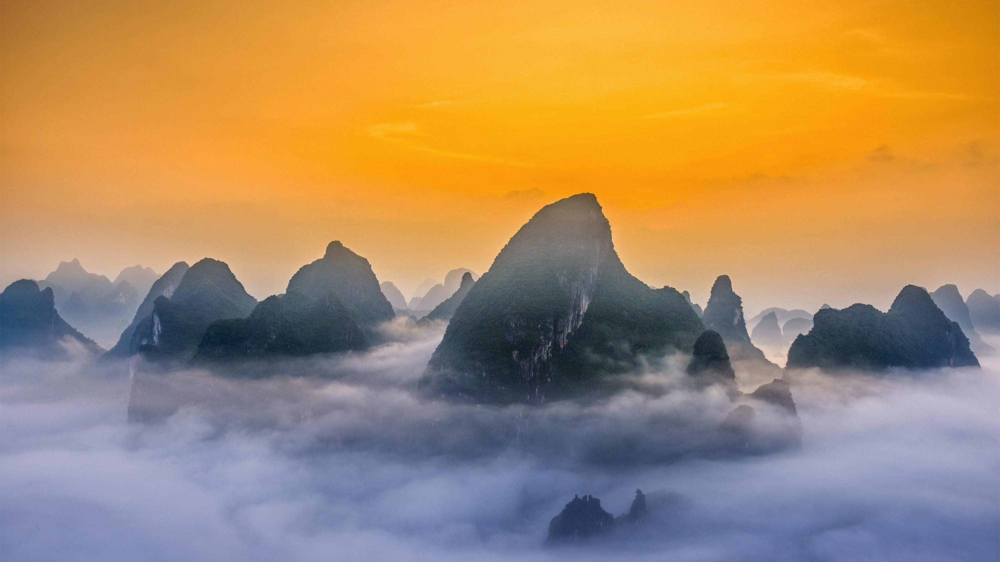

```json
{
  "images": [
    {
      "startdate": "20221021",
      "fullstartdate": "202210211600",
      "enddate": "20221022",
      "url": "/th?id=OHR.KarstMountains_ZH-CN4719178982_UHD.jpg&rf=LaDigue_UHD.jpg&pid=hp&w=3840&h=2160&rs=1&c=4",
      "urlbase": "/th?id=OHR.KarstMountains_ZH-CN4719178982",
      "copyright": "中国桂林漓江国家公园的喀斯特山脉 (© Sean Pavone/Alamy)",
      "copyrightlink": "/search?q=%e6%a1%82%e6%9e%97%e6%bc%93%e6%b1%9f%e9%a3%8e%e6%99%af%e5%8c%ba&form=hpcapt&mkt=zh-cn",
      "title": "云山雾绕",
      "quiz": "/search?q=Bing+homepage+quiz&filters=WQOskey:%22HPQuiz_20221021_KarstMountains%22&FORM=HPQUIZ",
      "wp": true,
      "hsh": "dcb5329737447a4a337603ce4c0dd065",
      "drk": 1,
      "top": 1,
      "bot": 1,
      "hs": []
    }
  ],
  "tooltips": {
    "loading": "正在加载...",
    "previous": "上一个图像",
    "next": "下一个图像",
    "walle": "此图片不能下载用作壁纸。",
    "walls": "下载今日美图。仅限用作桌面壁纸。"
  }
}
```
