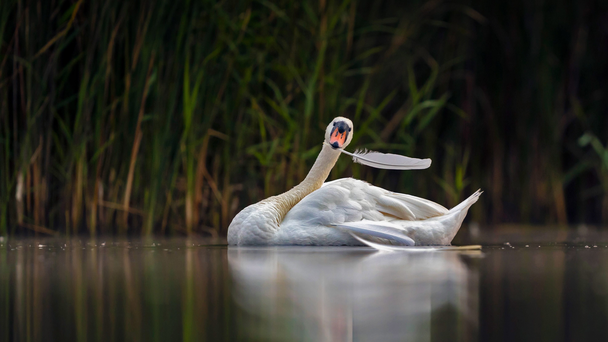

```json
{
  "images": [
    {
      "startdate": "20221022",
      "fullstartdate": "202210221600",
      "enddate": "20221023",
      "url": "/th?id=OHR.Knobbelzwaan_ZH-CN4850245302_UHD.jpg&rf=LaDigue_UHD.jpg&pid=hp&w=3840&h=2160&rs=1&c=4",
      "urlbase": "/th?id=OHR.Knobbelzwaan_ZH-CN4850245302",
      "copyright": "疣鼻天鹅，荷兰瓦尔肯霍斯特自然保护区 (© David Pattyn/Minden Pictures)",
      "copyrightlink": "/search?q=%e7%96%a3%e9%bc%bb%e5%a4%a9%e9%b9%85&form=hpcapt&mkt=zh-cn",
      "title": "疣鼻天鹅",
      "quiz": "/search?q=Bing+homepage+quiz&filters=WQOskey:%22HPQuiz_20221022_Knobbelzwaan%22&FORM=HPQUIZ",
      "wp": true,
      "hsh": "6dcb1d0be11e8dee12bc90d67d1e6b55",
      "drk": 1,
      "top": 1,
      "bot": 1,
      "hs": []
    }
  ],
  "tooltips": {
    "loading": "正在加载...",
    "previous": "上一个图像",
    "next": "下一个图像",
    "walle": "此图片不能下载用作壁纸。",
    "walls": "下载今日美图。仅限用作桌面壁纸。"
  }
}
```
