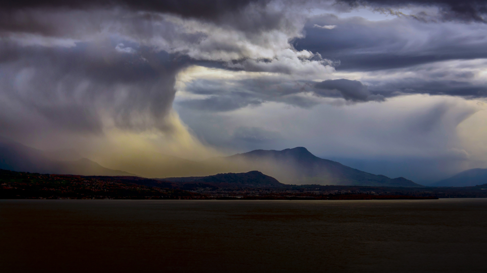

```json
{
  "images": [
    {
      "startdate": "20221027",
      "fullstartdate": "202210271600",
      "enddate": "20221028",
      "url": "/th?id=OHR.FrankensteinFriday_ZH-CN5814917673_UHD.jpg&rf=LaDigue_UHD.jpg&pid=hp&w=3840&h=2160&rs=1&c=4",
      "urlbase": "/th?id=OHR.FrankensteinFriday_ZH-CN5814917673",
      "copyright": "洛桑日内瓦湖上空的暴风雨，瑞典 (© Suradech Singhanat/Shutterstock)",
      "copyrightlink": "/search?q=%e6%97%a5%e5%86%85%e7%93%a6%e6%b9%96&form=hpcapt&mkt=zh-cn",
      "title": "一个黑暗的暴风雨之夜",
      "quiz": "/search?q=Bing+homepage+quiz&filters=WQOskey:%22HPQuiz_20221027_FrankensteinFriday%22&FORM=HPQUIZ",
      "wp": true,
      "hsh": "426b0dd10360d364a0fcab233d04a9e3",
      "drk": 1,
      "top": 1,
      "bot": 1,
      "hs": []
    }
  ],
  "tooltips": {
    "loading": "正在加载...",
    "previous": "上一个图像",
    "next": "下一个图像",
    "walle": "此图片不能下载用作壁纸。",
    "walls": "下载今日美图。仅限用作桌面壁纸。"
  }
}
```
