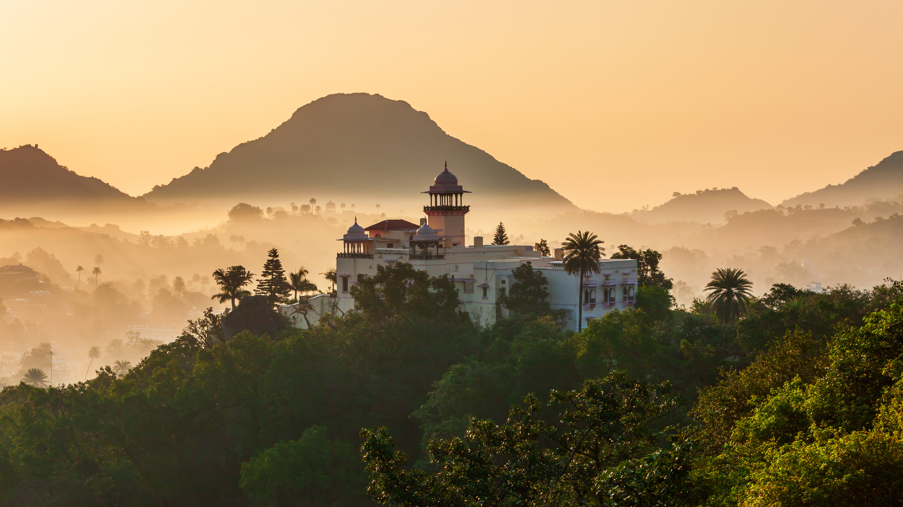

```json
{
  "images": [
    {
      "startdate": "20221110",
      "fullstartdate": "202211101600",
      "enddate": "20221111",
      "url": "/th?id=OHR.MountAbu_ZH-CN1348295593_UHD.jpg&rf=LaDigue_UHD.jpg&pid=hp&w=3840&h=2160&rs=1&c=4",
      "urlbase": "/th?id=OHR.MountAbu_ZH-CN1348295593",
      "copyright": "阿拉瓦利山脉的阿布山，印度拉贾斯坦邦 (© saiko3p/Shutterstock)",
      "copyrightlink": "/search?q=%e6%8b%89%e8%b4%be%e6%96%af%e5%9d%a6%e9%82%a6+%e9%98%bf%e5%b8%83%e5%b1%b1&form=hpcapt&mkt=zh-cn",
      "title": "沙漠中的绿洲",
      "quiz": "/search?q=Bing+homepage+quiz&filters=WQOskey:%22HPQuiz_20221110_MountAbu%22&FORM=HPQUIZ",
      "wp": true,
      "hsh": "b29b84fd4e589d7a8de8f3baf7c93f3b",
      "drk": 1,
      "top": 1,
      "bot": 1,
      "hs": []
    }
  ],
  "tooltips": {
    "loading": "正在加载...",
    "previous": "上一个图像",
    "next": "下一个图像",
    "walle": "此图片不能下载用作壁纸。",
    "walls": "下载今日美图。仅限用作桌面壁纸。"
  }
}
```
