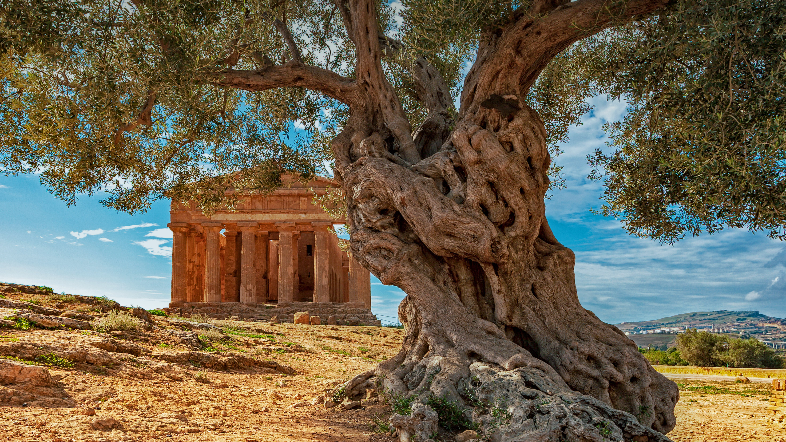

```json
{
  "images": [
    {
      "startdate": "20221125",
      "fullstartdate": "202211251600",
      "enddate": "20221126",
      "url": "/th?id=OHR.OliveTreeDay_ZH-CN3960861965_UHD.jpg&rf=LaDigue_UHD.jpg&pid=hp&w=3840&h=2160&rs=1&c=4",
      "urlbase": "/th?id=OHR.OliveTreeDay_ZH-CN3960861965",
      "copyright": "意大利西西里岛康科迪亚神庙前的一棵橄榄树 (© Alfio Finocchiaro/Shutterstock)",
      "copyrightlink": "/search?q=%e4%b8%96%e7%95%8c%e6%a9%84%e6%a6%84%e6%a0%91%e6%97%a5&form=hpcapt&mkt=zh-cn",
      "title": "和平的象征",
      "quiz": "/search?q=Bing+homepage+quiz&filters=WQOskey:%22HPQuiz_20221125_OliveTreeDay%22&FORM=HPQUIZ",
      "wp": true,
      "hsh": "0de918ec328f1d8aec660d17e9ceebd9",
      "drk": 1,
      "top": 1,
      "bot": 1,
      "hs": []
    }
  ],
  "tooltips": {
    "loading": "正在加载...",
    "previous": "上一个图像",
    "next": "下一个图像",
    "walle": "此图片不能下载用作壁纸。",
    "walls": "下载今日美图。仅限用作桌面壁纸。"
  }
}
```
