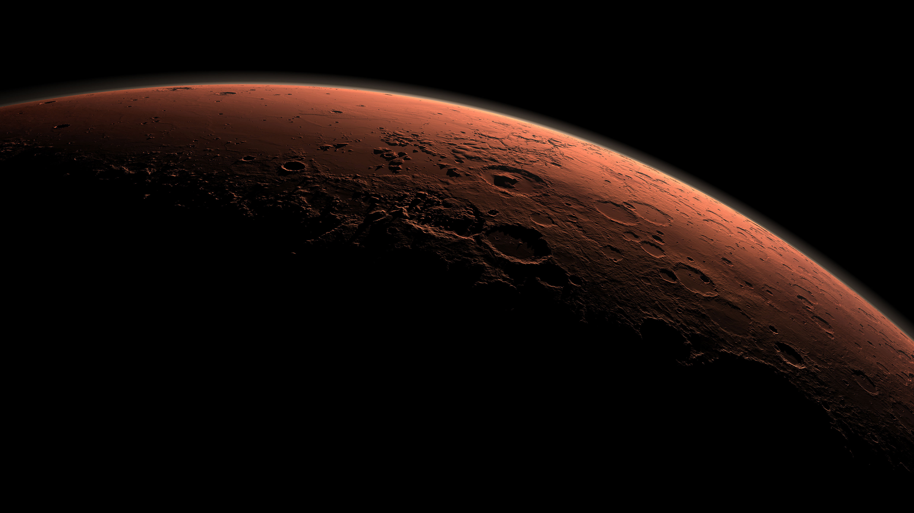

```json
{
  "images": [
    {
      "startdate": "20221127",
      "fullstartdate": "202211271600",
      "enddate": "20221128",
      "url": "/th?id=OHR.RedPlanetDay_ZH-CN4913018041_UHD.jpg&rf=LaDigue_UHD.jpg&pid=hp&w=3840&h=2160&rs=1&c=4",
      "urlbase": "/th?id=OHR.RedPlanetDay_ZH-CN4913018041",
      "copyright": "火星（© NASA/Alamy）",
      "copyrightlink": "/search?q=%e7%81%ab%e6%98%9f&form=hpcapt&mkt=zh-cn",
      "title": "太阳系的第四颗行星",
      "quiz": "/search?q=Bing+homepage+quiz&filters=WQOskey:%22HPQuiz_20221127_RedPlanetDay%22&FORM=HPQUIZ",
      "wp": true,
      "hsh": "31282dabb5d53694be5bd0a619455030",
      "drk": 1,
      "top": 1,
      "bot": 1,
      "hs": []
    }
  ],
  "tooltips": {
    "loading": "正在加载...",
    "previous": "上一个图像",
    "next": "下一个图像",
    "walle": "此图片不能下载用作壁纸。",
    "walls": "下载今日美图。仅限用作桌面壁纸。"
  }
}
```
