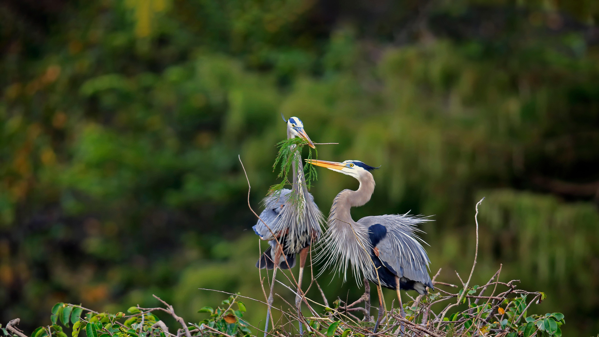

```json
{
  "images": [
    {
      "startdate": "20221128",
      "fullstartdate": "202211281600",
      "enddate": "20221129",
      "url": "/th?id=OHR.HeronGiving_ZH-CN5229629007_UHD.jpg&rf=LaDigue_UHD.jpg&pid=hp&w=3840&h=2160&rs=1&c=4",
      "urlbase": "/th?id=OHR.HeronGiving_ZH-CN5229629007",
      "copyright": "正在筑巢的大蓝鹭，佛罗里达州瓦可达哈齐湿地，美国 (© Imagebroker/Alamy)",
      "copyrightlink": "/search?q=%e7%bb%99%e4%ba%88%e6%98%9f%e6%9c%9f%e4%ba%8c&form=hpcapt&mkt=zh-cn",
      "title": "付出和给予的一天",
      "quiz": "/search?q=Bing+homepage+quiz&filters=WQOskey:%22HPQuiz_20221128_HeronGiving%22&FORM=HPQUIZ",
      "wp": true,
      "hsh": "ea2ea87deab2a2027d87f6abbcb96356",
      "drk": 1,
      "top": 1,
      "bot": 1,
      "hs": []
    }
  ],
  "tooltips": {
    "loading": "正在加载...",
    "previous": "上一个图像",
    "next": "下一个图像",
    "walle": "此图片不能下载用作壁纸。",
    "walls": "下载今日美图。仅限用作桌面壁纸。"
  }
}
```
