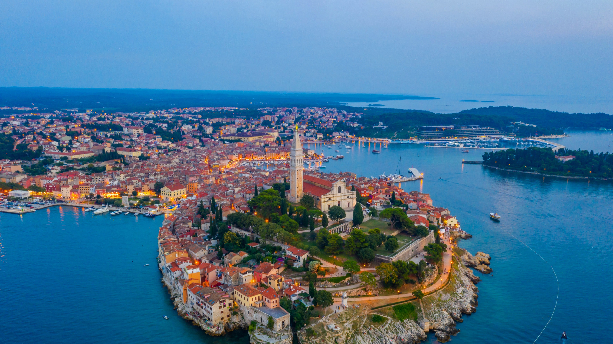

```json
{
  "images": [
    {
      "startdate": "20221129",
      "fullstartdate": "202211291600",
      "enddate": "20221130",
      "url": "/th?id=OHR.RovinjCroatia_ZH-CN5459110500_UHD.jpg&rf=LaDigue_UHD.jpg&pid=hp&w=3840&h=2160&rs=1&c=4",
      "urlbase": "/th?id=OHR.RovinjCroatia_ZH-CN5459110500",
      "copyright": "罗维尼老城，克罗地亚 (© trabantos/Shutterstock)",
      "copyrightlink": "/search?q=%e5%85%8b%e7%bd%97%e5%9c%b0%e4%ba%9a%e7%bd%97%e7%bb%b4%e5%b0%bc&form=hpcapt&mkt=zh-cn",
      "title": "亚得里亚海边的明珠",
      "quiz": "/search?q=Bing+homepage+quiz&filters=WQOskey:%22HPQuiz_20221129_RovinjCroatia%22&FORM=HPQUIZ",
      "wp": true,
      "hsh": "1d06f1b2c66aef4e8267094cbd20da64",
      "drk": 1,
      "top": 1,
      "bot": 1,
      "hs": []
    }
  ],
  "tooltips": {
    "loading": "正在加载...",
    "previous": "上一个图像",
    "next": "下一个图像",
    "walle": "此图片不能下载用作壁纸。",
    "walls": "下载今日美图。仅限用作桌面壁纸。"
  }
}
```
