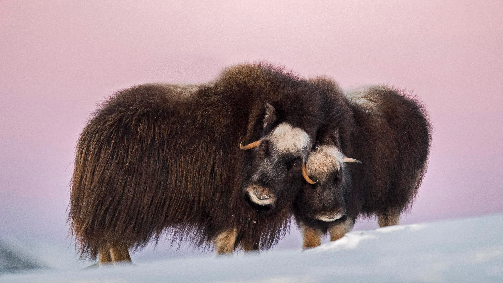

```json
{
  "images": [
    {
      "startdate": "20221208",
      "fullstartdate": "202212081600",
      "enddate": "20221209",
      "url": "/th?id=OHR.NorwayMuskox_ZH-CN6137934745_UHD.jpg&rf=LaDigue_UHD.jpg&pid=hp&w=3840&h=2160&rs=1&c=4",
      "urlbase": "/th?id=OHR.NorwayMuskox_ZH-CN6137934745",
      "copyright": "多弗勒山-松达尔国家公园的麝牛与她的宝宝，挪威 (© Robert Haasmann/Minden Pictures)",
      "copyrightlink": "/search?q=%e9%ba%9d%e7%89%9b&form=hpcapt&mkt=zh-cn",
      "title": "这些古老的动物是什么？",
      "quiz": "/search?q=Bing+homepage+quiz&filters=WQOskey:%22HPQuiz_20221208_NorwayMuskox%22&FORM=HPQUIZ",
      "wp": true,
      "hsh": "836b56d382852a8cfe4cc67f36d1cdea",
      "drk": 1,
      "top": 1,
      "bot": 1,
      "hs": []
    }
  ],
  "tooltips": {
    "loading": "正在加载...",
    "previous": "上一个图像",
    "next": "下一个图像",
    "walle": "此图片不能下载用作壁纸。",
    "walls": "下载今日美图。仅限用作桌面壁纸。"
  }
}
```
