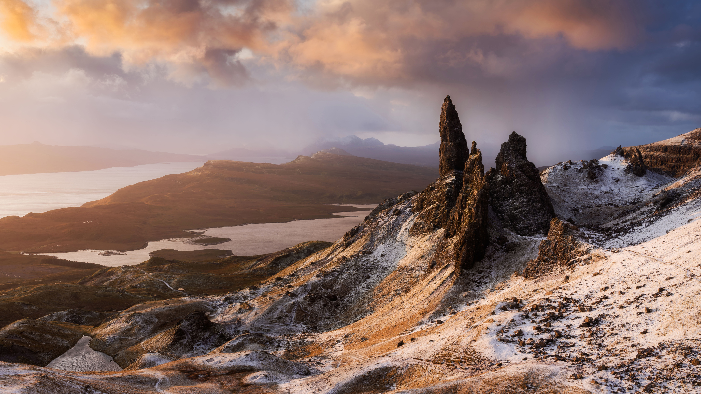

```json
{
  "images": [
    {
      "startdate": "20221228",
      "fullstartdate": "202212281600",
      "enddate": "20221229",
      "url": "/th?id=OHR.StorrRocks_ZH-CN4956679462_UHD.jpg&rf=LaDigue_UHD.jpg&pid=hp&w=3840&h=2160&rs=1&c=4",
      "urlbase": "/th?id=OHR.StorrRocks_ZH-CN4956679462",
      "copyright": "斯托尔石山，天空之岛，苏格兰 (© Aliaume Chapelle/Tandem Stills + Motion)",
      "copyrightlink": "/search?q=%e8%8b%8f%e6%a0%bc%e5%85%b0%e5%a4%a9%e7%a9%ba%e4%b9%8b%e5%b2%9b&form=hpcapt&mkt=zh-cn",
      "title": "天空之岛",
      "quiz": "/search?q=Bing+homepage+quiz&filters=WQOskey:%22HPQuiz_20221228_StorrRocks%22&FORM=HPQUIZ",
      "wp": true,
      "hsh": "adaae7886bd11729b0e041402ed65e36",
      "drk": 1,
      "top": 1,
      "bot": 1,
      "hs": []
    }
  ],
  "tooltips": {
    "loading": "正在加载...",
    "previous": "上一个图像",
    "next": "下一个图像",
    "walle": "此图片不能下载用作壁纸。",
    "walls": "下载今日美图。仅限用作桌面壁纸。"
  }
}
```
