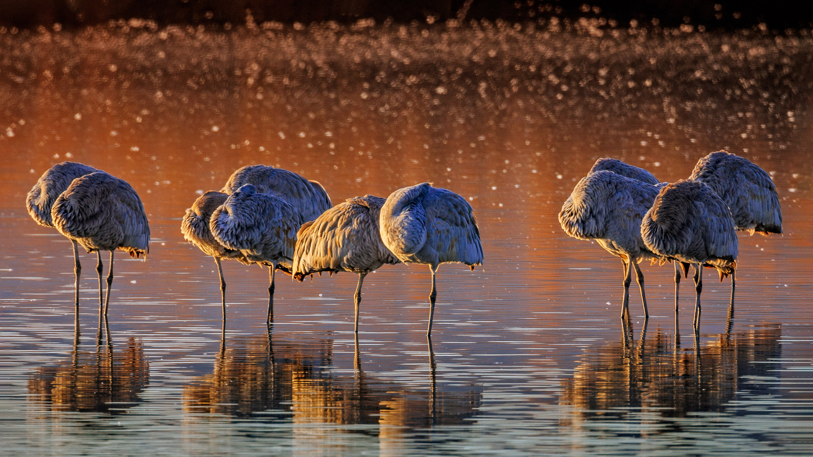

```json
{
  "images": [
    {
      "startdate": "20230102",
      "fullstartdate": "202301021600",
      "enddate": "20230103",
      "url": "/th?id=OHR.SandhillSleeping_ZH-CN8483997851_UHD.jpg&rf=LaDigue_UHD.jpg&pid=hp&w=3840&h=2160&rs=1&c=4",
      "urlbase": "/th?id=OHR.SandhillSleeping_ZH-CN8483997851",
      "copyright": "博斯克·德尔·阿帕奇国家野生动物保护区的沙丘鹤，美国新墨西哥州 (© Jay Goodrich/Tandem Stills + Motion)",
      "copyrightlink": "/search?q=%e6%b2%99%e4%b8%98%e9%b9%a4&form=hpcapt&mkt=zh-cn",
      "title": "谁在打盹儿？",
      "quiz": "/search?q=Bing+homepage+quiz&filters=WQOskey:%22HPQuiz_20230102_SandhillSleeping%22&FORM=HPQUIZ",
      "wp": true,
      "hsh": "4b13a2776505b92ee6f58527b47704c1",
      "drk": 1,
      "top": 1,
      "bot": 1,
      "hs": []
    }
  ],
  "tooltips": {
    "loading": "正在加载...",
    "previous": "上一个图像",
    "next": "下一个图像",
    "walle": "此图片不能下载用作壁纸。",
    "walls": "下载今日美图。仅限用作桌面壁纸。"
  }
}
```
