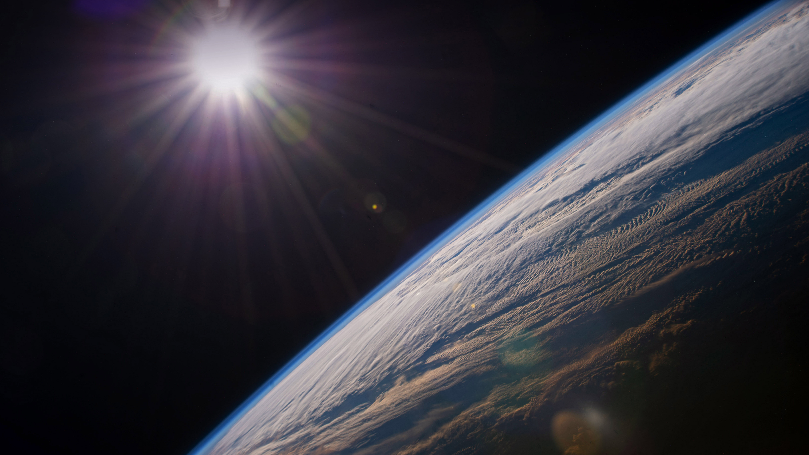

```json
{
  "images": [
    {
      "startdate": "20230103",
      "fullstartdate": "202301031600",
      "enddate": "20230104",
      "url": "/th?id=OHR.Perihelion_ZH-CN8681537155_UHD.jpg&rf=LaDigue_UHD.jpg&pid=hp&w=3840&h=2160&rs=1&c=4",
      "urlbase": "/th?id=OHR.Perihelion_ZH-CN8681537155",
      "copyright": "从国际空间站看到的地球 (© JSC/NASA)",
      "copyrightlink": "/search?q=%e8%bf%91%e6%97%a5%e7%82%b9&form=hpcapt&mkt=zh-cn",
      "title": "如此接近，却又如此遥远",
      "quiz": "/search?q=Bing+homepage+quiz&filters=WQOskey:%22HPQuiz_20230103_Perihelion%22&FORM=HPQUIZ",
      "wp": true,
      "hsh": "a3e9ddb64fb6ebd4f1308d9202e7fd2c",
      "drk": 1,
      "top": 1,
      "bot": 1,
      "hs": []
    }
  ],
  "tooltips": {
    "loading": "正在加载...",
    "previous": "上一个图像",
    "next": "下一个图像",
    "walle": "此图片不能下载用作壁纸。",
    "walls": "下载今日美图。仅限用作桌面壁纸。"
  }
}
```
