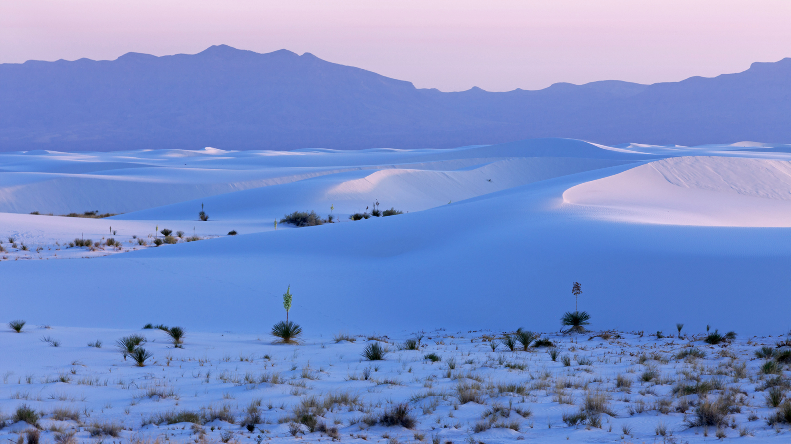

```json
{
  "images": [
    {
      "startdate": "20230117",
      "fullstartdate": "202301171600",
      "enddate": "20230118",
      "url": "/th?id=OHR.WhiteSands_ZH-CN6500188005_UHD.jpg&rf=LaDigue_UHD.jpg&pid=hp&w=3840&h=2160&rs=1&c=4",
      "urlbase": "/th?id=OHR.WhiteSands_ZH-CN6500188005",
      "copyright": "白沙国家公园，美国新墨西哥州 (© Andrea Harrell/Tandem Stills + Motion)",
      "copyrightlink": "/search?q=%e7%99%bd%e6%b2%99%e5%9b%bd%e5%ae%b6%e5%85%ac%e5%9b%ad&form=hpcapt&mkt=zh-cn",
      "title": "世界最大的石膏沙漠",
      "quiz": "/search?q=Bing+homepage+quiz&filters=WQOskey:%22HPQuiz_20230117_WhiteSands%22&FORM=HPQUIZ",
      "wp": true,
      "hsh": "12cffcb694beb443318aff07649bf5aa",
      "drk": 1,
      "top": 1,
      "bot": 1,
      "hs": []
    }
  ],
  "tooltips": {
    "loading": "正在加载...",
    "previous": "上一个图像",
    "next": "下一个图像",
    "walle": "此图片不能下载用作壁纸。",
    "walls": "下载今日美图。仅限用作桌面壁纸。"
  }
}
```
