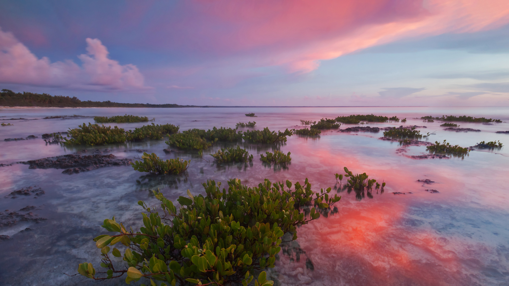

```json
{
  "images": [
    {
      "startdate": "20230126",
      "fullstartdate": "202301261600",
      "enddate": "20230127",
      "url": "/th?id=OHR.RedMangrove_ZH-CN4083989028_UHD.jpg&rf=LaDigue_UHD.jpg&pid=hp&w=3840&h=2160&rs=1&c=4",
      "urlbase": "/th?id=OHR.RedMangrove_ZH-CN4083989028",
      "copyright": "瓜纳阿卡维韦斯半岛国家公园的红树林，古巴 (© Claudio Contreras/Minden Pictures)",
      "copyrightlink": "/search?q=%e5%8f%a4%e5%b7%b4&form=hpcapt&mkt=zh-cn",
      "title": "向伟大的红树林致敬！",
      "quiz": "/search?q=Bing+homepage+quiz&filters=WQOskey:%22HPQuiz_20230126_RedMangrove%22&FORM=HPQUIZ",
      "wp": true,
      "hsh": "2b2c45bf2bf84bcd0484e085ad9c3ae6",
      "drk": 1,
      "top": 1,
      "bot": 1,
      "hs": []
    }
  ],
  "tooltips": {
    "loading": "正在加载...",
    "previous": "上一个图像",
    "next": "下一个图像",
    "walle": "此图片不能下载用作壁纸。",
    "walls": "下载今日美图。仅限用作桌面壁纸。"
  }
}
```
