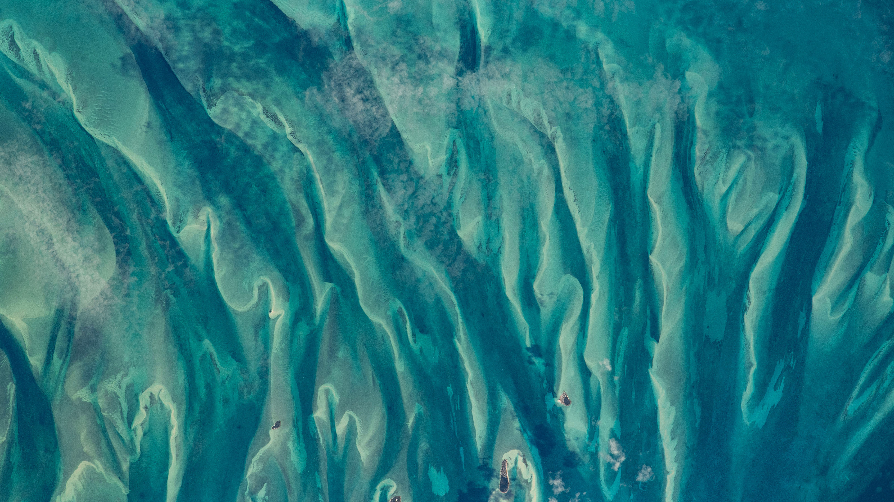

```json
{
  "images": [
    {
      "startdate": "20230127",
      "fullstartdate": "202301271600",
      "enddate": "20230128",
      "url": "/th?id=OHR.BlueBahamas_ZH-CN2083290847_UHD.jpg&rf=LaDigue_UHD.jpg&pid=hp&w=3840&h=2160&rs=1&c=4",
      "urlbase": "/th?id=OHR.BlueBahamas_ZH-CN2083290847",
      "copyright": "从国际空间站看到的巴哈马周围的蓝绿色水域 (© NASA)",
      "copyrightlink": "/search?q=%e5%b7%b4%e5%93%88%e9%a9%ac%e7%be%a4%e5%b2%9b&form=hpcapt&mkt=zh-cn",
      "title": "像极了艺术画作的真实照片",
      "quiz": "/search?q=Bing+homepage+quiz&filters=WQOskey:%22HPQuiz_20230127_BlueBahamas%22&FORM=HPQUIZ",
      "wp": true,
      "hsh": "262edb81ead7d3b97b8df4c234f84d74",
      "drk": 1,
      "top": 1,
      "bot": 1,
      "hs": []
    }
  ],
  "tooltips": {
    "loading": "正在加载...",
    "previous": "上一个图像",
    "next": "下一个图像",
    "walle": "此图片不能下载用作壁纸。",
    "walls": "下载今日美图。仅限用作桌面壁纸。"
  }
}
```
