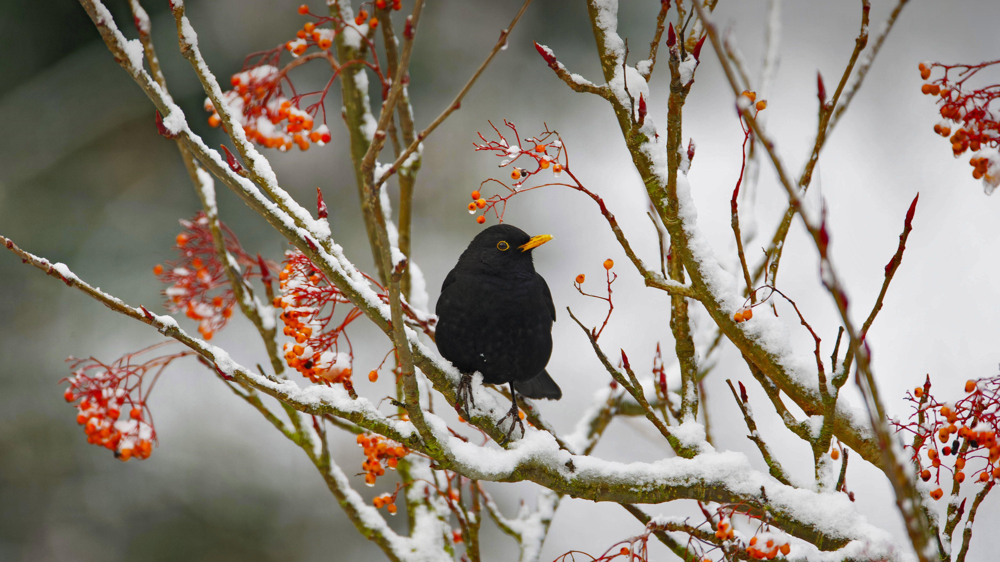

```json
{
  "images": [
    {
      "startdate": "20230128",
      "fullstartdate": "202301281600",
      "enddate": "20230129",
      "url": "/th?id=OHR.BlackbirdDay_ZH-CN2291101162_UHD.jpg&rf=LaDigue_UHD.jpg&pid=hp&w=3840&h=2160&rs=1&c=4",
      "urlbase": "/th?id=OHR.BlackbirdDay_ZH-CN2291101162",
      "copyright": "埃塞克斯的乌鸫，英国 (© Bill Coster/Alamy Stock Photo)",
      "copyrightlink": "/search?q=%e4%b9%8c%e9%b8%ab&form=hpcapt&mkt=zh-cn",
      "title": "为什么乌鸫与冬天联系紧密？",
      "quiz": "/search?q=Bing+homepage+quiz&filters=WQOskey:%22HPQuiz_20230128_BlackbirdDay%22&FORM=HPQUIZ",
      "wp": true,
      "hsh": "5916f138b3cd48bc55372cdcc733c51e",
      "drk": 1,
      "top": 1,
      "bot": 1,
      "hs": []
    }
  ],
  "tooltips": {
    "loading": "正在加载...",
    "previous": "上一个图像",
    "next": "下一个图像",
    "walle": "此图片不能下载用作壁纸。",
    "walls": "下载今日美图。仅限用作桌面壁纸。"
  }
}
```
