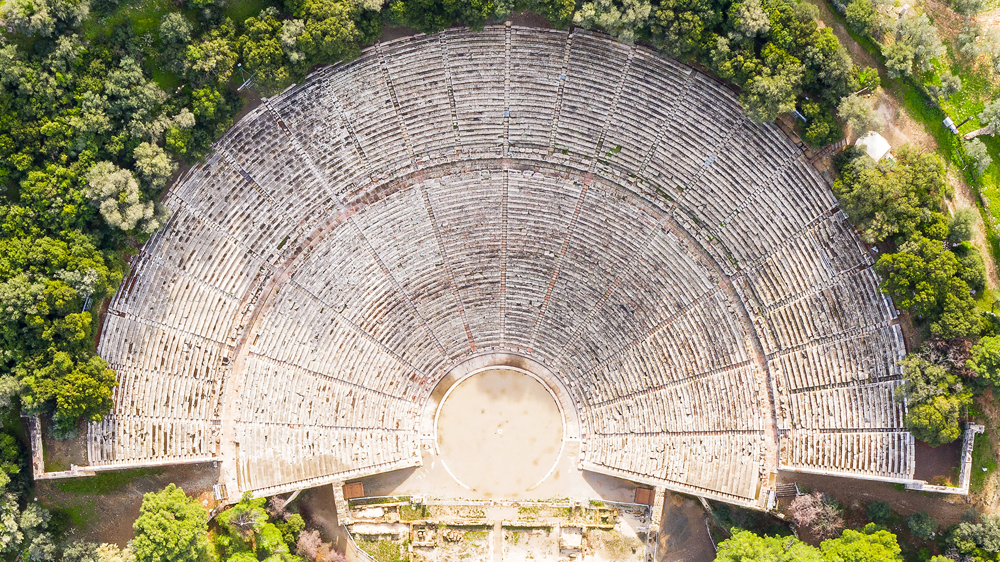

```json
{
  "images": [
    {
      "startdate": "20230209",
      "fullstartdate": "202302091600",
      "enddate": "20230210",
      "url": "/th?id=OHR.EpidaurusGreece_ZH-CN0640135476_UHD.jpg&rf=LaDigue_UHD.jpg&pid=hp&w=3840&h=2160&rs=1&c=4",
      "urlbase": "/th?id=OHR.EpidaurusGreece_ZH-CN0640135476",
      "copyright": "埃庇道鲁斯剧场, 希腊阿尔戈利斯省 (© George Pachantouris/Getty Images)",
      "copyrightlink": "/search?q=%e5%b8%8c%e8%85%8a%e9%98%bf%e5%b0%94%e6%88%88%e5%88%a9%e6%96%af%e7%9c%81&form=hpcapt&mkt=zh-cn",
      "title": "声学杰作",
      "quiz": "/search?q=Bing+homepage+quiz&filters=WQOskey:%22HPQuiz_20230209_EpidaurusGreece%22&FORM=HPQUIZ",
      "wp": true,
      "hsh": "115d26c0c9a97482cdcec6d99717ec8e",
      "drk": 1,
      "top": 1,
      "bot": 1,
      "hs": []
    }
  ],
  "tooltips": {
    "loading": "正在加载...",
    "previous": "上一个图像",
    "next": "下一个图像",
    "walle": "此图片不能下载用作壁纸。",
    "walls": "下载今日美图。仅限用作桌面壁纸。"
  }
}
```
