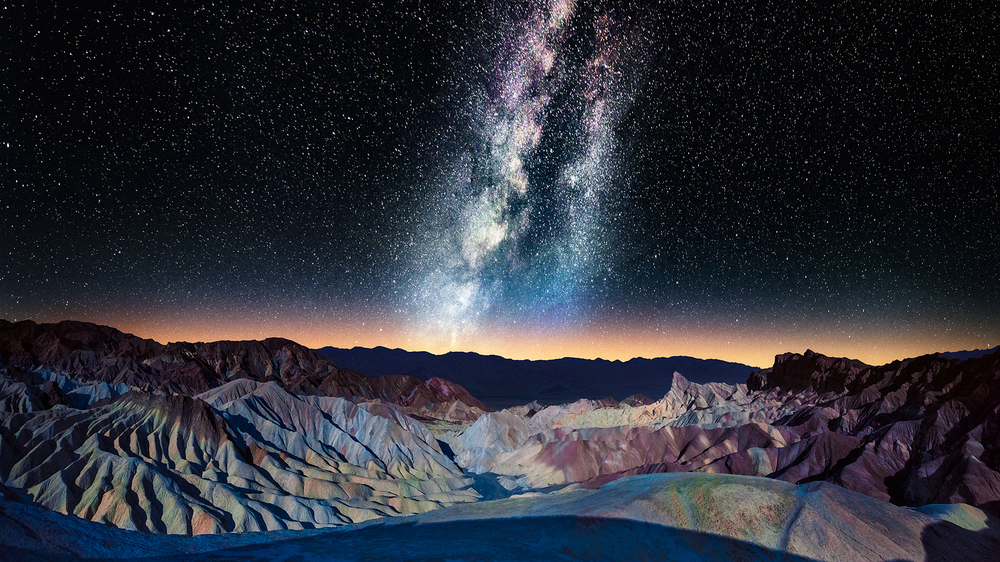

```json
{
  "images": [
    {
      "startdate": "20230210",
      "fullstartdate": "202302101600",
      "enddate": "20230211",
      "url": "/th?id=OHR.DarkSkiesDV_ZH-CN1076500221_UHD.jpg&rf=LaDigue_UHD.jpg&pid=hp&w=3840&h=2160&rs=1&c=4",
      "urlbase": "/th?id=OHR.DarkSkiesDV_ZH-CN1076500221",
      "copyright": "死亡谷扎布里斯基角上空的银河，美国加利福尼亚州 (© Matt Anderson Photography/Getty Images)",
      "copyrightlink": "/search?q=%e7%be%8e%e5%9b%bd%e6%ad%bb%e4%ba%a1%e8%b0%b7%e5%9b%bd%e5%ae%b6%e5%85%ac%e5%9b%ad&form=hpcapt&mkt=zh-cn",
      "title": "布满星星的天空",
      "quiz": "/search?q=Bing+homepage+quiz&filters=WQOskey:%22HPQuiz_20230210_DarkSkiesDV%22&FORM=HPQUIZ",
      "wp": true,
      "hsh": "b57f5fdee5623f5e32f38e7934692f32",
      "drk": 1,
      "top": 1,
      "bot": 1,
      "hs": []
    }
  ],
  "tooltips": {
    "loading": "正在加载...",
    "previous": "上一个图像",
    "next": "下一个图像",
    "walle": "此图片不能下载用作壁纸。",
    "walls": "下载今日美图。仅限用作桌面壁纸。"
  }
}
```
