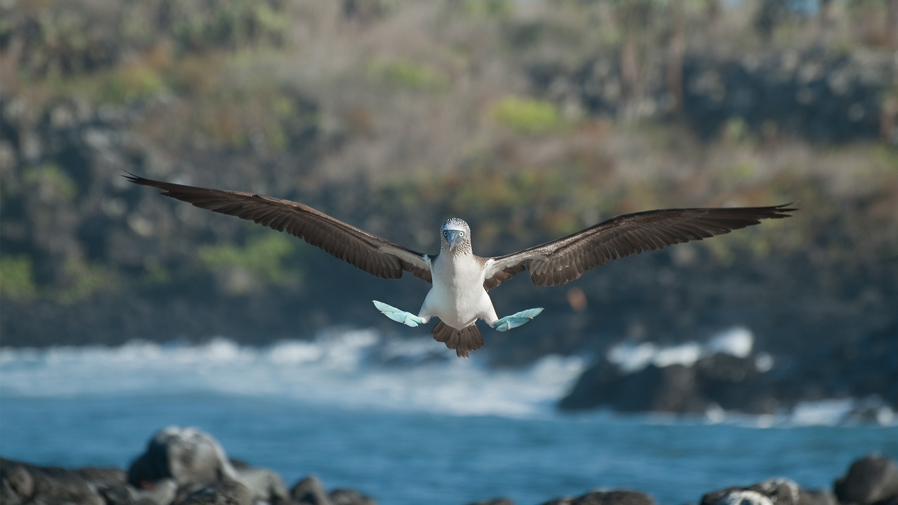

```json
{
  "images": [
    {
      "startdate": "20230211",
      "fullstartdate": "202302111600",
      "enddate": "20230212",
      "url": "/th?id=OHR.BoobyDarwinDay_ZH-CN9917306809_UHD.jpg&rf=LaDigue_UHD.jpg&pid=hp&w=3840&h=2160&rs=1&c=4",
      "urlbase": "/th?id=OHR.BoobyDarwinDay_ZH-CN9917306809",
      "copyright": "一对蓝脚鲣鸟，加拉帕戈斯群岛，厄瓜多尔 (© Tui De Roy/Minden Pictures)",
      "copyrightlink": "/search?q=%e8%93%9d%e8%84%9a%e9%b2%a3%e9%b8%9f&form=hpcapt&mkt=zh-cn",
      "title": "平稳着陆，双脚先行",
      "quiz": "/search?q=Bing+homepage+quiz&filters=WQOskey:%22HPQuiz_20230211_BoobyDarwinDay%22&FORM=HPQUIZ",
      "wp": true,
      "hsh": "8ead7c4802b6647b956de375fb13a8b2",
      "drk": 1,
      "top": 1,
      "bot": 1,
      "hs": []
    }
  ],
  "tooltips": {
    "loading": "正在加载...",
    "previous": "上一个图像",
    "next": "下一个图像",
    "walle": "此图片不能下载用作壁纸。",
    "walls": "下载今日美图。仅限用作桌面壁纸。"
  }
}
```
