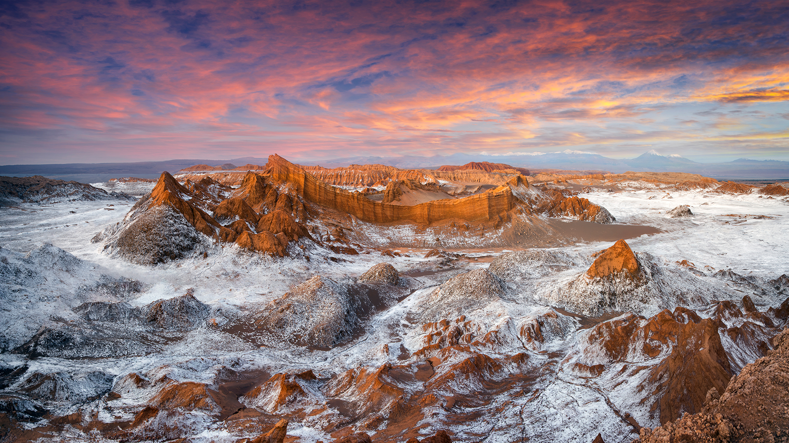

```json
{
  "images": [
    {
      "startdate": "20230212",
      "fullstartdate": "202302121600",
      "enddate": "20230213",
      "url": "/th?id=OHR.MoonValley_ZH-CN1906470869_UHD.jpg&rf=LaDigue_UHD.jpg&pid=hp&w=3840&h=2160&rs=1&c=4",
      "urlbase": "/th?id=OHR.MoonValley_ZH-CN1906470869",
      "copyright": "阿卡切斯瞭望台，月亮谷，智利 (© Ignacio Palacios/Getty Images)",
      "copyrightlink": "/search?q=%e6%99%ba%e5%88%a9%e6%9c%88%e4%ba%ae%e8%b0%b7&form=hpcapt&mkt=zh-cn",
      "title": "带我飞向月球",
      "quiz": "/search?q=Bing+homepage+quiz&filters=WQOskey:%22HPQuiz_20230212_MoonValley%22&FORM=HPQUIZ",
      "wp": true,
      "hsh": "633395d8c63761a726e696b6d36c9f8c",
      "drk": 1,
      "top": 1,
      "bot": 1,
      "hs": []
    }
  ],
  "tooltips": {
    "loading": "正在加载...",
    "previous": "上一个图像",
    "next": "下一个图像",
    "walle": "此图片不能下载用作壁纸。",
    "walls": "下载今日美图。仅限用作桌面壁纸。"
  }
}
```
