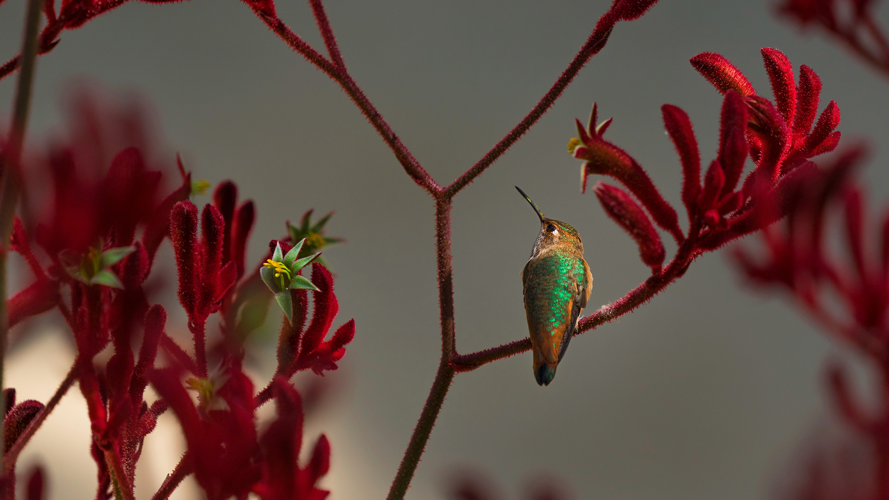

```json
{
  "images": [
    {
      "startdate": "20230216",
      "fullstartdate": "202302161600",
      "enddate": "20230217",
      "url": "/th?id=OHR.BirdcountAllen_ZH-CN4029022734_UHD.jpg&rf=LaDigue_UHD.jpg&pid=hp&w=3840&h=2160&rs=1&c=4",
      "urlbase": "/th?id=OHR.BirdcountAllen_ZH-CN4029022734",
      "copyright": "栖息在红袋鼠爪枝干上的艾氏煌蜂鸟 (© GypsyPictureShow/Shutterstock)",
      "copyrightlink": "/search?q=%e8%89%be%e6%b0%8f%e7%85%8c%e8%9c%82%e9%b8%9f&form=hpcapt&mkt=zh-cn",
      "title": "“后院鸟类统计”活动开始了！",
      "quiz": "/search?q=Bing+homepage+quiz&filters=WQOskey:%22HPQuiz_20230216_BirdcountAllen%22&FORM=HPQUIZ",
      "wp": true,
      "hsh": "d1b59994784e74e5361d3c95ccb0e958",
      "drk": 1,
      "top": 1,
      "bot": 1,
      "hs": []
    }
  ],
  "tooltips": {
    "loading": "正在加载...",
    "previous": "上一个图像",
    "next": "下一个图像",
    "walle": "此图片不能下载用作壁纸。",
    "walls": "下载今日美图。仅限用作桌面壁纸。"
  }
}
```
