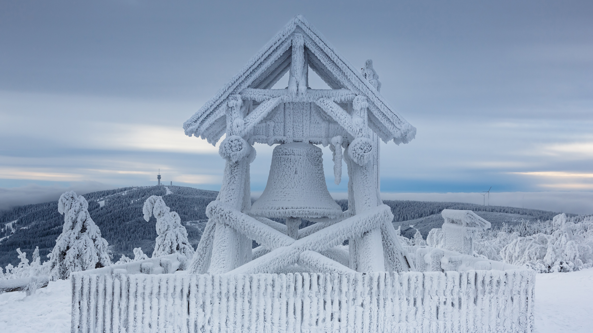

```json
{
  "images": [
    {
      "startdate": "20230221",
      "fullstartdate": "202302211600",
      "enddate": "20230222",
      "url": "/th?id=OHR.FriedensglockeFichtelberg_ZH-CN5510489151_UHD.jpg&rf=LaDigue_UHD.jpg&pid=hp&w=3840&h=2160&rs=1&c=4",
      "urlbase": "/th?id=OHR.FriedensglockeFichtelberg_ZH-CN5510489151",
      "copyright": "菲希特尔山脉上的和平钟，萨克森州，德国 (© Jan Drahokoupil/Getty Images)",
      "copyrightlink": "/search?q=%e8%8f%b2%e5%b8%8c%e7%89%b9%e5%b0%94%e5%b1%b1&form=hpcapt&mkt=zh-cn",
      "title": "和平之钟",
      "quiz": "/search?q=Bing+homepage+quiz&filters=WQOskey:%22HPQuiz_20230221_FriedensglockeFichtelberg%22&FORM=HPQUIZ",
      "wp": true,
      "hsh": "6968c11c13ca8460eae58d64e04accce",
      "drk": 1,
      "top": 1,
      "bot": 1,
      "hs": []
    }
  ],
  "tooltips": {
    "loading": "正在加载...",
    "previous": "上一个图像",
    "next": "下一个图像",
    "walle": "此图片不能下载用作壁纸。",
    "walls": "下载今日美图。仅限用作桌面壁纸。"
  }
}
```
