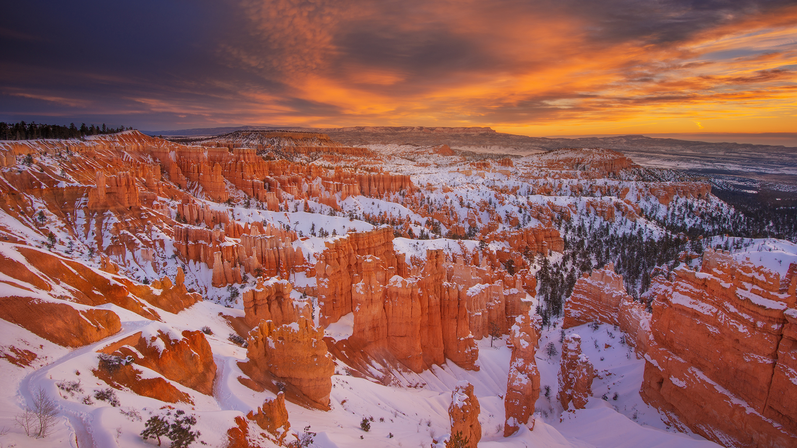

```json
{
  "images": [
    {
      "startdate": "20230224",
      "fullstartdate": "202302241600",
      "enddate": "20230225",
      "url": "/th?id=OHR.BryceAnniv_ZH-CN5305245786_UHD.jpg&rf=LaDigue_UHD.jpg&pid=hp&w=3840&h=2160&rs=1&c=4",
      "urlbase": "/th?id=OHR.BryceAnniv_ZH-CN5305245786",
      "copyright": "布莱斯峡谷国家公园的石林，犹他州，美国 (© Piriya Photography/Getty Images)",
      "copyrightlink": "/search?q=%e5%b8%83%e8%8e%b1%e6%96%af%e5%b3%a1%e8%b0%b7%e5%9b%bd%e5%ae%b6%e5%85%ac%e5%9b%ad&form=hpcapt&mkt=zh-cn",
      "title": "冬天的布莱斯峡谷石林",
      "quiz": "/search?q=Bing+homepage+quiz&filters=WQOskey:%22HPQuiz_20230224_BryceAnniv%22&FORM=HPQUIZ",
      "wp": true,
      "hsh": "6577f0cfc9d5fdea05f75826b2483cb9",
      "drk": 1,
      "top": 1,
      "bot": 1,
      "hs": []
    }
  ],
  "tooltips": {
    "loading": "正在加载...",
    "previous": "上一个图像",
    "next": "下一个图像",
    "walle": "此图片不能下载用作壁纸。",
    "walls": "下载今日美图。仅限用作桌面壁纸。"
  }
}
```
