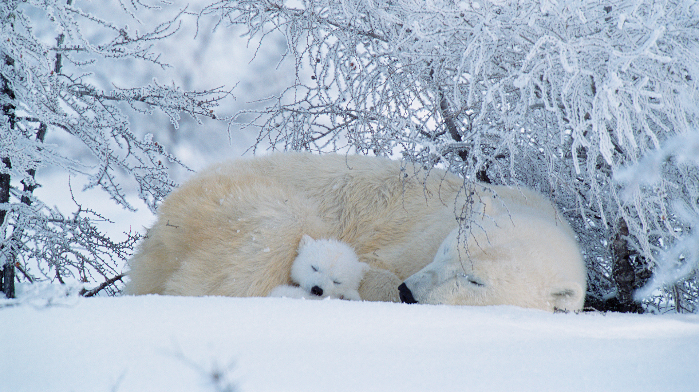

```json
{
  "images": [
    {
      "startdate": "20230226",
      "fullstartdate": "202302261600",
      "enddate": "20230227",
      "url": "/th?id=OHR.PolarBearFrost_ZH-CN5918160947_UHD.jpg&rf=LaDigue_UHD.jpg&pid=hp&w=3840&h=2160&rs=1&c=4",
      "urlbase": "/th?id=OHR.PolarBearFrost_ZH-CN5918160947",
      "copyright": "北极熊在加拿大沉睡 (© David Pike/Minden Pictures)",
      "copyrightlink": "/search?q=%e5%8c%97%e6%9e%81%e7%86%8a&form=hpcapt&mkt=zh-cn",
      "title": "冰冷的北极，温暖的拥抱",
      "quiz": "/search?q=Bing+homepage+quiz&filters=WQOskey:%22HPQuiz_20230226_PolarBearFrost%22&FORM=HPQUIZ",
      "wp": true,
      "hsh": "6680087fa2e6f794453de5daab0425f6",
      "drk": 1,
      "top": 1,
      "bot": 1,
      "hs": []
    }
  ],
  "tooltips": {
    "loading": "正在加载...",
    "previous": "上一个图像",
    "next": "下一个图像",
    "walle": "此图片不能下载用作壁纸。",
    "walls": "下载今日美图。仅限用作桌面壁纸。"
  }
}
```
