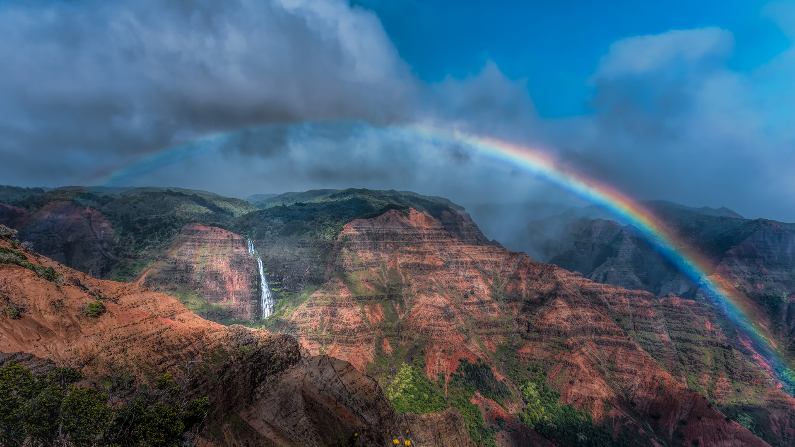

```json
{"images":[{"startdate":"20230308","fullstartdate":"202303081600","enddate":"20230309","url":"/th?id=OHR.WaimeaRainbow_ZH-CN1127225170_UHD.jpg&rf=LaDigue_UHD.jpg&pid=hp&w=3840&h=2160&rs=1&c=4","urlbase":"/th?id=OHR.WaimeaRainbow_ZH-CN1127225170","copyright":"威美亚峡谷和怀波奥瀑布上空的彩虹,考艾岛，夏威夷，美国 (© Beverley Van Praagh/Getty Images)","copyrightlink":"/search?q=%e5%a8%81%e7%be%8e%e4%ba%9a%e5%b3%a1%e8%b0%b7&form=hpcapt&mkt=zh-cn","title":"雨后见彩虹","quiz":"/search?q=Bing+homepage+quiz&filters=WQOskey:%22HPQuiz_20230308_WaimeaRainbow%22&FORM=HPQUIZ","wp":true,"hsh":"4bdfb95297331f172f9326b1058d6b1b","drk":1,"top":1,"bot":1,"hs":[]}],"tooltips":{"loading":"正在加载...","previous":"上一个图像","next":"下一个图像","walle":"此图片不能下载用作壁纸。","walls":"下载今日美图。仅限用作桌面壁纸。"}}
```
