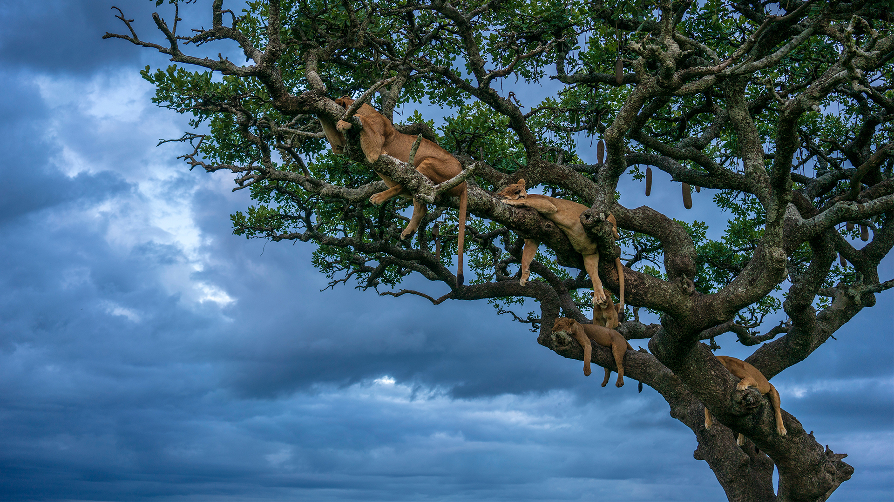

```json
{"images":[{"startdate":"20230312","fullstartdate":"202303121600","enddate":"20230313","url":"/th?id=OHR.LionessesNap_ZH-CN9240393299_UHD.jpg&rf=LaDigue_UHD.jpg&pid=hp&w=3840&h=2160&rs=1&c=4","urlbase":"/th?id=OHR.LionessesNap_ZH-CN9240393299","copyright":"正在睡觉的母狮, 塞伦盖蒂国家公园，坦桑利亚 (© Cavan Images/Shutterstock)","copyrightlink":"/search?q=%e5%a1%9e%e4%bc%a6%e7%9b%96%e8%92%82%e5%9b%bd%e5%ae%b6%e5%85%ac%e5%9b%ad&form=hpcapt&mkt=zh-cn","title":"午睡消除烦恼","quiz":"/search?q=Bing+homepage+quiz&filters=WQOskey:%22HPQuiz_20230312_LionessesNap%22&FORM=HPQUIZ","wp":true,"hsh":"9f84fc0f8159caf6651c3f122a03a295","drk":1,"top":1,"bot":1,"hs":[]}],"tooltips":{"loading":"正在加载...","previous":"上一个图像","next":"下一个图像","walle":"此图片不能下载用作壁纸。","walls":"下载今日美图。仅限用作桌面壁纸。"}}
```
