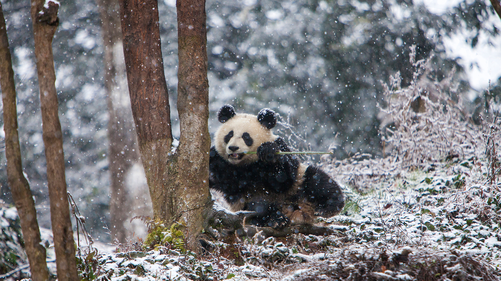

```json
{
    "images": [{
        "startdate": "20230315",
        "fullstartdate": "202303151600",
        "enddate": "20230316",
        "url": "/th?id=OHR.ChengduPanda_ZH-CN0043208941_UHD.jpg&rf=LaDigue_UHD.jpg&pid=hp&w=3840&h=2160&rs=1&c=4",
        "urlbase": "/th?id=OHR.ChengduPanda_ZH-CN0043208941",
        "copyright": "成都大熊猫繁育研究基地，中国 (© Jim Zuckerman/Jaynes Gallery/DanitaDelimont)",
        "copyrightlink": "/search?q=%e6%88%90%e9%83%bd%e5%a4%a7%e7%86%8a%e7%8c%ab%e7%b9%81%e8%82%b2%e7%a0%94%e7%a9%b6%e5%9f%ba%e5%9c%b0&form=hpcapt&mkt=zh-cn",
        "title": "熊猫喜欢冬天吗？",
        "quiz": "/search?q=Bing+homepage+quiz&filters=WQOskey:%22HPQuiz_20230315_ChengduPanda%22&FORM=HPQUIZ",
        "wp": true,
        "hsh": "c0cc2b1a06b7367f1cdeccd862e3ec82",
        "drk": 1,
        "top": 1,
        "bot": 1,
        "hs": []
    }],
    "tooltips": {
        "loading": "正在加载...",
        "previous": "上一个图像",
        "next": "下一个图像",
        "walle": "此图片不能下载用作壁纸。",
        "walls": "下载今日美图。仅限用作桌面壁纸。"
    }
}```
