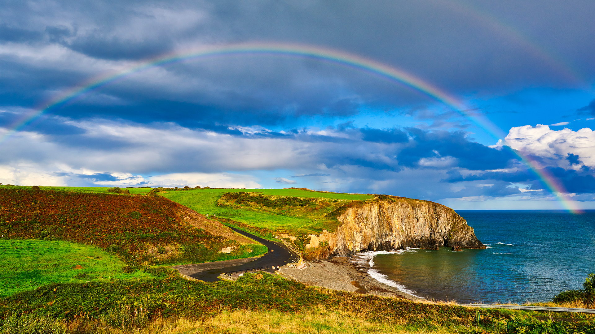

```json
{"images":[{"startdate":"20230316","fullstartdate":"202303161600","enddate":"20230317","url":"/th?id=OHR.BallyvooneyCove_ZH-CN0284564457_UHD.jpg&rf=LaDigue_UHD.jpg&pid=hp&w=3840&h=2160&rs=1&c=4","urlbase":"/th?id=OHR.BallyvooneyCove_ZH-CN0284564457","copyright":"ballyvooney海岸，科佩海岸地质公园，爱尔兰 (© Andrea Pistolesi/Getty Images)","copyrightlink":"/search?q=%e7%88%b1%e5%b0%94%e5%85%b0%e7%a7%91%e4%bd%a9%e6%b5%b7%e5%b2%b8%e5%9c%b0%e8%b4%a8%e5%85%ac%e5%9b%ad&form=hpcapt&mkt=zh-cn","title":"彩虹的尽头","quiz":"/search?q=Bing+homepage+quiz&filters=WQOskey:%22HPQuiz_20230316_BallyvooneyCove%22&FORM=HPQUIZ","wp":true,"hsh":"11ee471e472acf50967ef67c9f4a6eae","drk":1,"top":1,"bot":1,"hs":[]}],"tooltips":{"loading":"正在加载...","previous":"上一个图像","next":"下一个图像","walle":"此图片不能下载用作壁纸。","walls":"下载今日美图。仅限用作桌面壁纸。"}}
```
