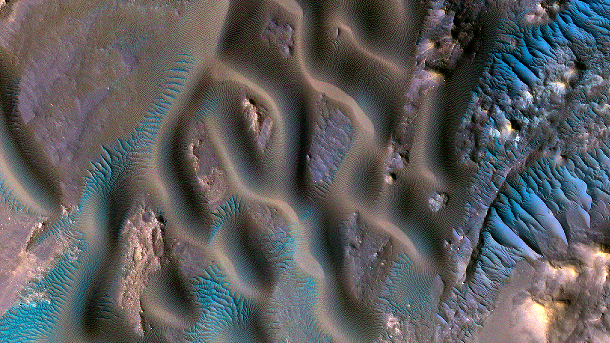

```json
{"images":[{"startdate":"20230317","fullstartdate":"202303171600","enddate":"20230318","url":"/th?id=OHR.MarsTars_ZH-CN0496313394_UHD.jpg&rf=LaDigue_UHD.jpg&pid=hp&w=3840&h=2160&rs=1&c=4","urlbase":"/th?id=OHR.MarsTars_ZH-CN0496313394","copyright":"甘博阿陨击坑，火星 (© NASA/JPL-Caltech/University of Arizona)","copyrightlink":"/search?q=%e7%81%ab%e6%98%9f&form=hpcapt&mkt=zh-cn","title":"此景只应天上有","quiz":"/search?q=Bing+homepage+quiz&filters=WQOskey:%22HPQuiz_20230317_MarsTars%22&FORM=HPQUIZ","wp":true,"hsh":"919a80fbf9db69d5625f3c576e779e35","drk":1,"top":1,"bot":1,"hs":[]}],"tooltips":{"loading":"正在加载...","previous":"上一个图像","next":"下一个图像","walle":"此图片不能下载用作壁纸。","walls":"下载今日美图。仅限用作桌面壁纸。"}}
```
