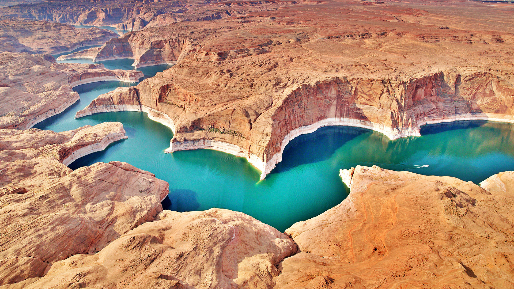

```json
{"images":[{"startdate":"20230321","fullstartdate":"202303211600","enddate":"20230322","url":"/th?id=OHR.LakePowellAerial_ZH-CN1427611965_UHD.jpg&rf=LaDigue_UHD.jpg&pid=hp&w=3840&h=2160&rs=1&c=4","urlbase":"/th?id=OHR.LakePowellAerial_ZH-CN1427611965","copyright":"鲍威尔湖，美国 (© Peter Schaefer/Alamy)","copyrightlink":"/search?q=%e9%b2%8d%e5%a8%81%e5%b0%94%e6%b9%96&form=hpcapt&mkt=zh-cn","title":"蜿蜒曲折的人工湖泊，鲍威尔湖","quiz":"/search?q=Bing+homepage+quiz&filters=WQOskey:%22HPQuiz_20230321_LakePowellAerial%22&FORM=HPQUIZ","wp":true,"hsh":"2aab7d1c013f2573bd7d75683695db32","drk":1,"top":1,"bot":1,"hs":[]}],"tooltips":{"loading":"正在加载...","previous":"上一个图像","next":"下一个图像","walle":"此图片不能下载用作壁纸。","walls":"下载今日美图。仅限用作桌面壁纸。"}}
```
