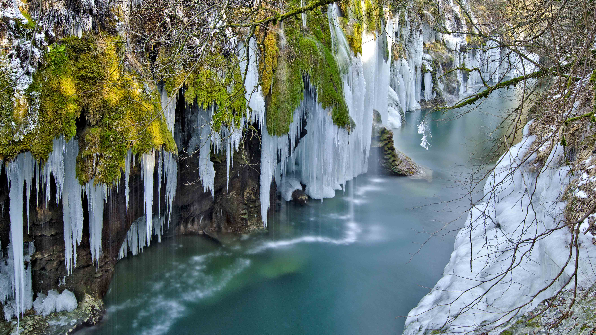

```json
{
  "images": [
    {
      "startdate": "20230322",
      "fullstartdate": "202303221600",
      "enddate": "20230323",
      "url": "/th?id=OHR.ChavarocheWinter_ZH-CN1842519491_UHD.jpg&rf=LaDigue_UHD.jpg&pid=hp&w=3840&h=2160&rs=1&c=4",
      "urlbase": "/th?id=OHR.ChavarocheWinter_ZH-CN1842519491",
      "copyright": "杜费里峡谷，上萨瓦省，法国 (© Jean-Philippe Delobelle/Biosphoto/Alamy)",
      "copyrightlink": "/search?q=%e6%9d%9c%e8%b4%b9%e9%87%8c%e5%b3%a1%e8%b0%b7&form=hpcapt&mkt=zh-cn",
      "title": "惊人的自然奇观",
      "quiz": "/search?q=Bing+homepage+quiz&filters=WQOskey:%22HPQuiz_20230322_ChavarocheWinter%22&FORM=HPQUIZ",
      "wp": true,
      "hsh": "02d1b9e8b9c20f74540969fc872957a7",
      "drk": 1,
      "top": 1,
      "bot": 1,
      "hs": []
    }
  ],
  "tooltips": {
    "loading": "正在加载...",
    "previous": "上一个图像",
    "next": "下一个图像",
    "walle": "此图片不能下载用作壁纸。",
    "walls": "下载今日美图。仅限用作桌面壁纸。"
  }
}
```
