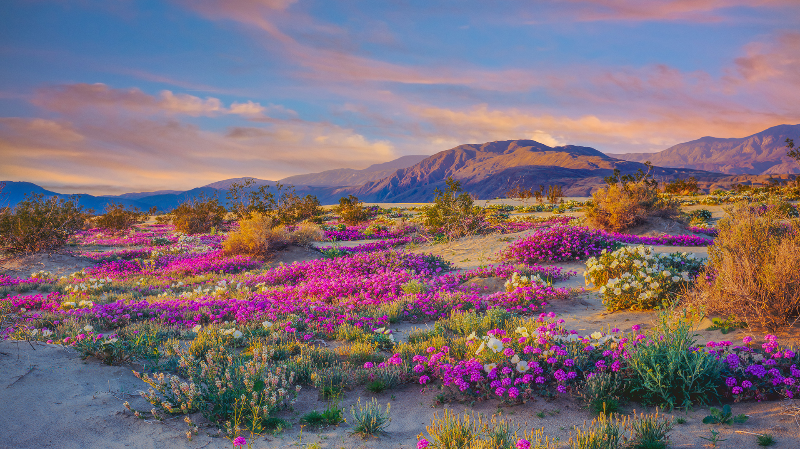

```json
{
  "images": [
    {
      "startdate": "20230325",
      "fullstartdate": "202303251600",
      "enddate": "20230326",
      "url": "/th?id=OHR.WildAnza_ZH-CN2384861750_UHD.jpg&rf=LaDigue_UHD.jpg&pid=hp&w=3840&h=2160&rs=1&c=4",
      "urlbase": "/th?id=OHR.WildAnza_ZH-CN2384861750",
      "copyright": "安沙波利哥沙漠州立公园的野花，加利福尼亚州，美国 (© Ron and Patty Thomas/Getty Images)",
      "copyrightlink": "/search?q=%e5%ae%89%e6%b2%99%e6%b3%a2%e5%88%a9%e5%93%a5%e6%b2%99%e6%bc%a0%e5%b7%9e%e7%ab%8b%e5%85%ac%e5%9b%ad&form=hpcapt&mkt=zh-cn",
      "title": "大自然最为色彩鲜艳的一面",
      "quiz": "/search?q=Bing+homepage+quiz&filters=WQOskey:%22HPQuiz_20230325_WildAnza%22&FORM=HPQUIZ",
      "wp": true,
      "hsh": "c590fa6c04972c1d04b24aeb914aeb88",
      "drk": 1,
      "top": 1,
      "bot": 1,
      "hs": []
    }
  ],
  "tooltips": {
    "loading": "正在加载...",
    "previous": "上一个图像",
    "next": "下一个图像",
    "walle": "此图片不能下载用作壁纸。",
    "walls": "下载今日美图。仅限用作桌面壁纸。"
  }
}
```
