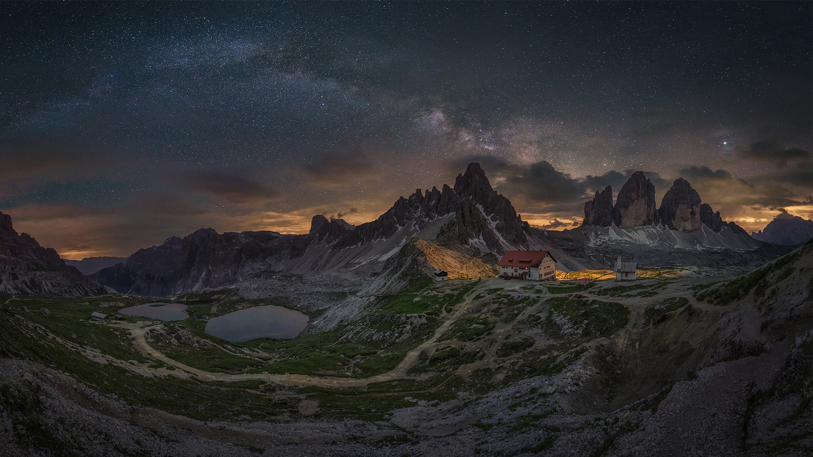

```json
{
  "images": [
    {
      "startdate": "20230327",
      "fullstartdate": "202303271600",
      "enddate": "20230328",
      "url": "/th?id=OHR.MWDolomites_ZH-CN2886991396_UHD.jpg&rf=LaDigue_UHD.jpg&pid=hp&w=3840&h=2160&rs=1&c=4",
      "urlbase": "/th?id=OHR.MWDolomites_ZH-CN2886991396",
      "copyright": "意大利三峰山上空的银河 (© Juan Romero/Cavan Images)",
      "copyrightlink": "/search?q=%e6%84%8f%e5%a4%a7%e5%88%a9%e4%b8%89%e5%b3%b0%e5%b1%b1&form=hpcapt&mkt=zh-cn",
      "title": "这些蔚为壮观的山峰在何处？",
      "quiz": "/search?q=Bing+homepage+quiz&filters=WQOskey:%22HPQuiz_20230327_MWDolomites%22&FORM=HPQUIZ",
      "wp": true,
      "hsh": "1fe519c3fd740a23ab2525bbc5c3547b",
      "drk": 1,
      "top": 1,
      "bot": 1,
      "hs": []
    }
  ],
  "tooltips": {
    "loading": "正在加载...",
    "previous": "上一个图像",
    "next": "下一个图像",
    "walle": "此图片不能下载用作壁纸。",
    "walls": "下载今日美图。仅限用作桌面壁纸。"
  }
}
```
