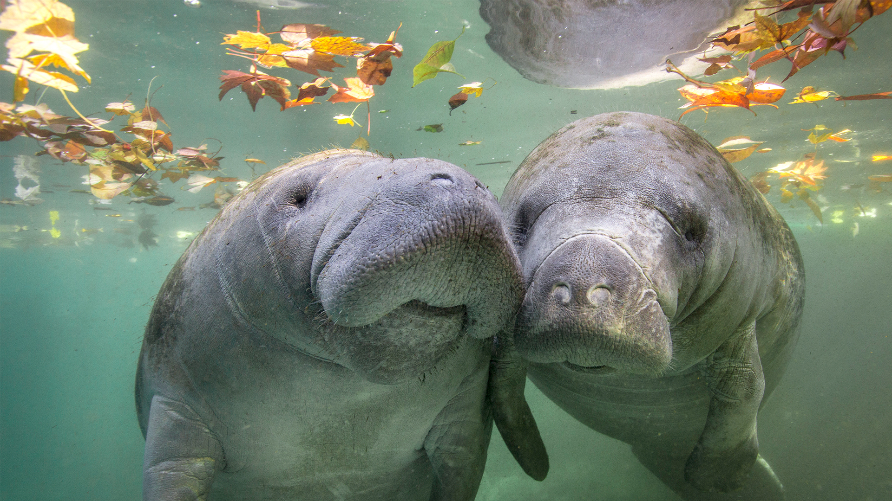

```json
{
  "images": [
    {
      "startdate": "20230328",
      "fullstartdate": "202303281600",
      "enddate": "20230329",
      "url": "/th?id=OHR.NuzzleManatee_ZH-CN3263788190_UHD.jpg&rf=LaDigue_UHD.jpg&pid=hp&w=3840&h=2160&rs=1&c=4",
      "urlbase": "/th?id=OHR.NuzzleManatee_ZH-CN3263788190",
      "copyright": "两只海牛，佛罗里达州的水晶河，美国 (© Gregory Sweeney/Getty Images)",
      "copyrightlink": "/search?q=%e6%b5%b7%e7%89%9b&form=hpcapt&mkt=zh-cn",
      "title": "世界海牛日",
      "quiz": "/search?q=Bing+homepage+quiz&filters=WQOskey:%22HPQuiz_20230328_NuzzleManatee%22&FORM=HPQUIZ",
      "wp": true,
      "hsh": "a0b011f7cb7d805d4e5217fc05b129b9",
      "drk": 1,
      "top": 1,
      "bot": 1,
      "hs": []
    }
  ],
  "tooltips": {
    "loading": "正在加载...",
    "previous": "上一个图像",
    "next": "下一个图像",
    "walle": "此图片不能下载用作壁纸。",
    "walls": "下载今日美图。仅限用作桌面壁纸。"
  }
}
```
