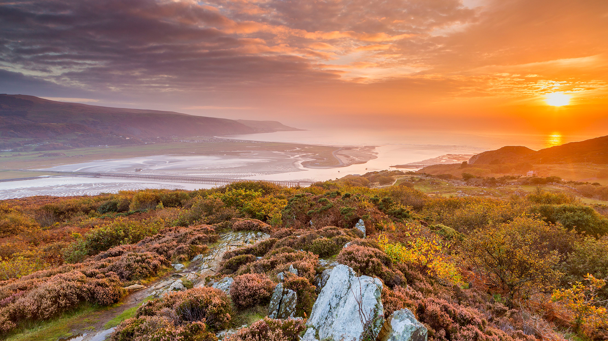

```json
{
  "images": [
    {
      "startdate": "20230412",
      "fullstartdate": "202304121600",
      "enddate": "20230413",
      "url": "/th?id=OHR.SnowdoniaNational_ZH-CN7415540950_UHD.jpg&rf=LaDigue_UHD.jpg&pid=hp&w=3840&h=2160&rs=1&c=4",
      "urlbase": "/th?id=OHR.SnowdoniaNational_ZH-CN7415540950",
      "copyright": "斯诺登尼亚国家公园，威尔士，英国 (© Sebastian Wasek/eStock Photo)",
      "copyrightlink": "/search?q=%e6%96%af%e8%af%ba%e7%99%bb%e5%b0%bc%e4%ba%9a%e5%9b%bd%e5%ae%b6%e5%85%ac%e5%9b%ad&form=hpcapt&mkt=zh-cn",
      "title": "徒步旅行者的向往之地",
      "quiz": "/search?q=Bing+homepage+quiz&filters=WQOskey:%22HPQuiz_20230412_SnowdoniaNational%22&FORM=HPQUIZ",
      "wp": true,
      "hsh": "23c6bc20066aa8692651709847ba04ac",
      "drk": 1,
      "top": 1,
      "bot": 1,
      "hs": []
    }
  ],
  "tooltips": {
    "loading": "正在加载...",
    "previous": "上一个图像",
    "next": "下一个图像",
    "walle": "此图片不能下载用作壁纸。",
    "walls": "下载今日美图。仅限用作桌面壁纸。"
  }
}
```
