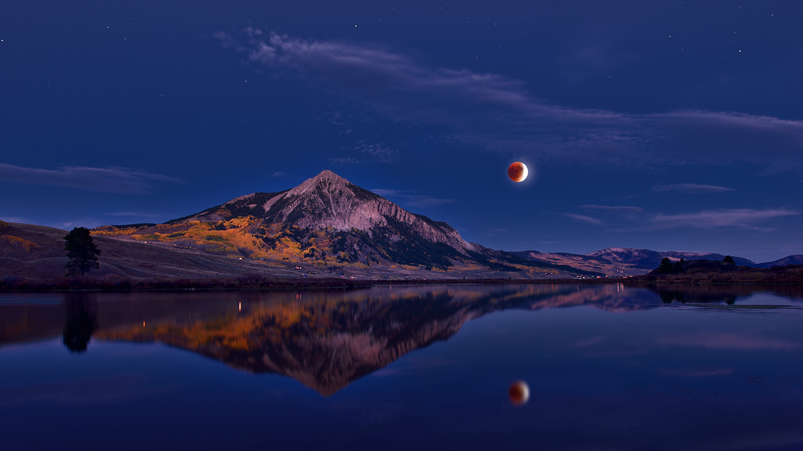

```json
{
  "images": [
    {
      "startdate": "20230419",
      "fullstartdate": "202304191600",
      "enddate": "20230420",
      "url": "/th?id=OHR.CrestedButteEclispe_ZH-CN5715446670_UHD.jpg&rf=LaDigue_UHD.jpg&pid=hp&w=3840&h=2160&rs=1&c=4",
      "urlbase": "/th?id=OHR.CrestedButteEclispe_ZH-CN5715446670",
      "copyright": "克雷斯特德比特山上方的月食，科罗拉多州，美国 (© Mengzhonghua Photography/Getty Images)",
      "copyrightlink": "/search?q=%e7%94%98%e5%b0%bc%e6%a3%ae%e5%9b%bd%e5%ae%b6%e6%a3%ae%e6%9e%97&form=hpcapt&mkt=zh-cn",
      "title": "宁静的夜空",
      "quiz": "/search?q=Bing+homepage+quiz&filters=WQOskey:%22HPQuiz_20230419_CrestedButteEclispe%22&FORM=HPQUIZ",
      "wp": true,
      "hsh": "93656f11fb18919cbf0f5b16aacf6097",
      "drk": 1,
      "top": 1,
      "bot": 1,
      "hs": []
    }
  ],
  "tooltips": {
    "loading": "正在加载...",
    "previous": "上一个图像",
    "next": "下一个图像",
    "walle": "此图片不能下载用作壁纸。",
    "walls": "下载今日美图。仅限用作桌面壁纸。"
  }
}
```
