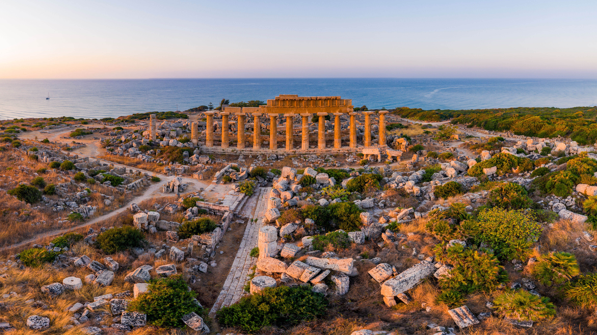

```json
{
  "images": [
    {
      "startdate": "20230429",
      "fullstartdate": "202304291600",
      "enddate": "20230430",
      "url": "/th?id=OHR.TempleE_ZH-CN9455488333_UHD.jpg&rf=LaDigue_UHD.jpg&pid=hp&w=3840&h=2160&rs=1&c=4",
      "urlbase": "/th?id=OHR.TempleE_ZH-CN9455488333",
      "copyright": "塞利努斯的神庙，西西里岛，意大利 (© Antonino Bartuccio/eStock)",
      "copyrightlink": "/search?q=%e5%a1%9e%e5%88%a9%e5%86%9c%e7%89%b9&form=hpcapt&mkt=zh-cn",
      "title": "伟大的遗迹",
      "quiz": "/search?q=Bing+homepage+quiz&filters=WQOskey:%22HPQuiz_20230429_TempleE%22&FORM=HPQUIZ",
      "wp": true,
      "hsh": "13b86f57d9d6fef41860eb32a14c3e8f",
      "drk": 1,
      "top": 1,
      "bot": 1,
      "hs": []
    }
  ],
  "tooltips": {
    "loading": "正在加载...",
    "previous": "上一个图像",
    "next": "下一个图像",
    "walle": "此图片不能下载用作壁纸。",
    "walls": "下载今日美图。仅限用作桌面壁纸。"
  }
}
```
