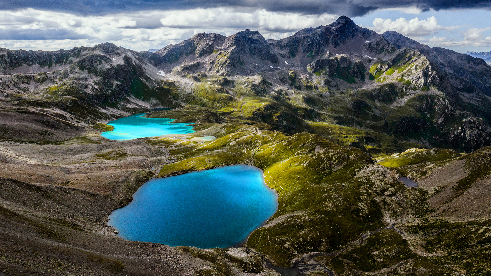

```json
{
  "images": [
    {
      "startdate": "20230501",
      "fullstartdate": "202305011600",
      "enddate": "20230502",
      "url": "/th?id=OHR.KlostersSerneus_ZH-CN9821473046_UHD.jpg&rf=LaDigue_UHD.jpg&pid=hp&w=3840&h=2160&rs=1&c=4",
      "urlbase": "/th?id=OHR.KlostersSerneus_ZH-CN9821473046",
      "copyright": "阿尔卑斯山脉锡尔夫雷塔山的乔里森湖，瑞士 (© Florin Baumann/Getty Images)",
      "copyrightlink": "/search?q=%e9%94%a1%e5%b0%94%e5%a4%ab%e9%9b%b7%e5%a1%94%e5%b1%b1&form=hpcapt&mkt=zh-cn",
      "title": "蓝湖和险峰",
      "quiz": "/search?q=Bing+homepage+quiz&filters=WQOskey:%22HPQuiz_20230501_KlostersSerneus%22&FORM=HPQUIZ",
      "wp": true,
      "hsh": "7d3c61199f3e57cf09e7439e4503ed16",
      "drk": 1,
      "top": 1,
      "bot": 1,
      "hs": []
    }
  ],
  "tooltips": {
    "loading": "正在加载...",
    "previous": "上一个图像",
    "next": "下一个图像",
    "walle": "此图片不能下载用作壁纸。",
    "walls": "下载今日美图。仅限用作桌面壁纸。"
  }
}
```
